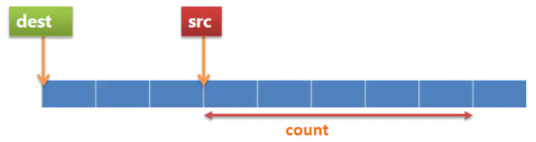
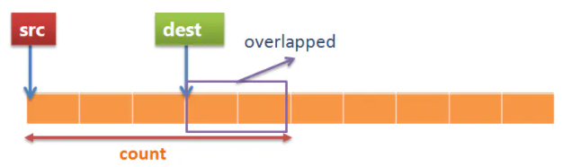

# strcpy

```
char* Strcpy(char* dst,const char* src)
{
	assert((dst != NULL) && (src != NULL));
	char* res = dst;
	//@ 后缀++ 优先于解引用* 运算符
	//@ 会拷贝 '\0' 到目的字符串
	while ((*dst++ = *src++) != '\0')
		;
	return res;
}
```

- 要确保 dst 有足够的空间容纳 src
- dst 和 src 空间不能重叠
- 返回 char* 是为了满足链式表达式
- 会从 src 拷贝 '\0' 到 dst

# strlen

```
int Strlen(const char* str)
{
	assert(str != NULL);
	int res = 0;
	while (*str++ != '\0')
		res++;
	return res;
}
```

- strlen 计算字符串长度，字符串必须是以 '\0' 结尾

# strcat

```
char* Strcat(char* dst,const char* src)
{
	assert((dst != NULL) && (src != NULL));
	char* res = dst;
	while (*dst != '\0')
		dst++;
	while ((*dst++ = *src++) != '\0')
		;
	return res;
}
```

- 要确保 dst 有足够的空间容纳 src
- dst 和 src 空间不能重叠
- 返回 char* 是为了满足链式表达式
- 会从 src 拷贝 '\0' 到 dst

# strcmp

```
int Strcmp(const char *s1, const char *s2)
{
	assert((s1 != NULL) && (s2 != NULL));
	while (*s1 == *s2)
	{
		if (*s1 == '\0')
			return 0;
		++s1;
		++s2;
	}
	return (*s1 - *s2) > 0 ? 1 :-1;
}
```

- 两个字符串自左向右逐个字符相比（按ASCII值大小相比较），直到出现不同的字符或遇 \0 为止
  - 若 s1 == s2，返回零
  - 若 s1 > s2，返回正数
  - 若 s1 < s2，返回负数

# strncpy 

```
char *Strncpy(char *dst, const char *src, size_t n)
{
	assert((dst != NULL) && (src != NULL));
	size_t i;
	for (i = 0; i < n && src[i] != '\0'; i++)
		dst[i] = src[i];
	for (; i < n; i++)
		dst[i] = '\0';
	return dst;
}
```

- 如果 src 的长度小于 n，dst 剩余的字节会被 '\0' 填充

- 如果 src 的长度大于 n，dst 的末尾不会添加 '\0'，因此，通常在使用 strncpy 时：

```
memset(dst, 0, MAX);   //@ 使用之前先将 dst 空间清0，有些浪费
dst[MAX-1] = '\0';     //@ 使用之后将 dst 末尾置 '\0'
```
#  sprintf  和 snprintf

sprintf  也可以用于字符串的拷贝：

```
sprintf(dst, "%s", src);
```

- 需要保证 dst 有足够的空间

snprintf 用于字符串拷贝是一种即简洁又安全的方式：

```
char buf[MAX]; 
snprintf(buf, sizeof(buf), "%s", src);
```

- snprintf 的特点是安全，不管怎么着，它都能保证结果串 buf 以 '\0' 结尾
- 返回值表示要写入的字符串长度 

# memcpy

```
void *Memcpy(void *dst, const void *src, size_t count)
{
	assert((dst != nullptr) && (src != nullptr));
	char *tmp = (char *)dst;
	const char *s = (char *)src;

	while (count--)
		*tmp++ = *s++;

	return dst;
}
```

- 与 strcpy 相比，memcpy 并不是遇到 '\0' 就结束，而是一定会拷贝完 count 个字节
- 性能方面： strncpy() 最差，snprintf 次之，memcpy 性能最佳，因此任何时候不要考虑使用 strncpy
- 复制的两个区域存在重叠时使用 memcpy，其结果是不可预知的，有可能成功也有可能失败的，所以如果使用了memcpy，程序员自身必须确保两块内存没有重叠部分
- memcpy 对于内存重叠的情况处理：
  - 情况一：能够正确拷贝
  
  - 情况二：此时会发生覆盖，结果是未定义的
    
  


避免区域重叠的实现：

```
void* Memecpy(void* dst,const void* src,size_t count)
{
	assert((dst != NULL) && (src != NULL));
	unsigned char* pdst = (unsigned char*)dst;
	const unsigned char* psrc = (const unsigned char*)src;

	//@ 检查内存重叠
	if (pdst >= psrc && pdst < psrc + count || psrc >= pdst && psrc < pdst + count)
		return NULL;
	while (count--)
	{
		*pdst = *psrc;
		pdst++;
		psrc++;
	}
	return dst;
}
```

加速优化的实现：

```
void* Memecpy2(void* dst, const void* src, size_t count)
{
	assert((dst != NULL) && (src != NULL));
	//@ 检查内存重叠
	bool flag1 = (char*)dst >= (char*)src && (char*)dst < (char*)src + count;
	bool flag2 = (char*)src >= (char*)dst && (char*)src < (char*)dst + count;
	if (flag1 || flag2)
		return NULL;

	size_t wordCount = count / 4, byteCount = count % 4;
	int* pWorddst = (int*)dst;
	const int* pWordsrc = (int*)src;

	while (wordCount--)
		*pWorddst++ = *pWordsrc++;
		
	char* pBytedst = (char*)pWorddst;
	const char* pBytesrc = (char*)pWordsrc;
	while (byteCount--)
		*pBytedst++ = *pBytesrc++;
	return dst;
}
```

- 地址不对齐时，memcpy 会逐字节拷贝，但是地址对齐时，一般使用 CPU 字长来 copy，上面展示按照 CPU 字长为4进行copy

# memmove

```
void* Memmove(void* dst, const void* src, size_t count)
{
	assert((dst != nullptr) && (src != nullptr));
	char* pdst = (char*)dst;
	const char* psrc = (const char*)src;

	if (psrc > pdst || psrc + count <= pdst)
	{
		while (count--) 
			*pdst++ = *psrc++;
	}
	else
	{
		//@ 从高地址到低地址遍历拷贝
		pdst += count - 1;
		psrc += count - 1;
		while (count--)
			*(pdst--) = *(psrc--);
	}
	return dst;
}
```

- memmove 会处理内存重叠的情况

# memset

- memeset 是以字节为单位进行赋值的

## memset 初始化 int 数组

- 对 int 数组进行初始化，仅能初始化为 -1 和 0：

```
	int array[3] = { 0 };
	memset(array, 0, sizeof(array));  //@ array[0] = array[1] = array[2] = 0
	memset(array, 255, sizeof(array));  //@ array[0] = array[1] = array[2] = -1
```

int 型变量是 4 个字节，也就是 32 位二进制数。那么在初始化时会将 4 个用于初始化的字符组合成一个 int 型的值：

```
memset(array, 1, sizeof(array));
```

1 的二进制数为 00000001， memset函数初始化时每个字节为：

```
00000001 00000001 00000001 00000001  //@ 16843009
```

全部为0，或者全部为1时：

```
00000000 00000000 00000000 00000000  //@ 0
11111111 11111111 11111111 11111111  //@ -1
```

## memset初始化 char 数组

能够正确初始化：

```
char array[3] = { 0 };
memset(array,'A', sizeof(array));
//@ 等价于
memset(array,65, sizeof(array));
```


