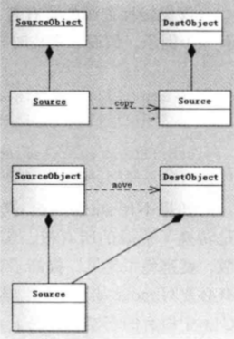

move 只是转移了资源的控制权，本质上是将左值强制转换为右值，以使用 move 语义，避免含有资源的对象发生了无谓的拷贝。

深拷贝和 move 的区别：



- move 对于拥有内存，文件句柄等资源对象的成员有效。
- 如果是一些基本类型，比如 int 和 char[10] 数组等，如果使用 move 还是会发生拷贝，因为它们没有对应的移动构造函数。

```
std::list<std::string> tokens;
std::list<std::string> t = std::move(tokens);  //@ move 几乎没有任何代价
```


