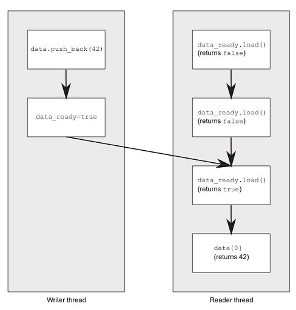

# 内存模型基础

为了避免 race condition，线程就要规定执行顺序。

- 一种方式是使用 mutex，后一线程必须等待前一线程解锁。
- 第二种方式是使用原子操作来避免竞争访问同一内存位置。

原子操作是不可分割的操作，要么做了要么没做，不存在做一半的状态。

# C++ 中的原子操作和原子类型

## 标准原子类型

标准原子类型定义在 <atomic> 中。也可以用 mutex 模拟原子操作，实际上标准原子类型可能就是这样实现的，它们都有一个 is_lock_free 函数，返回 true  说明该原子类型操作是无锁的，用的是原子指令，返回 false 则是用锁。

```
struct A { int a[1000]; };
struct B { int x, y; };

std::cout << std::boolalpha
    << std::atomic<A>{}.is_lock_free()
    << "\n"
    << std::atomic<B>{}.is_lock_free()
    << "\n";
```

原子操作的主要用处是替代 mutex 实现同步。如果原子操作内部是用 mutex 实现的，就不会有期望的性能提升，还不如直接用 mutex 来同步。C++17 中每个原子类型都有一个 is_always_lock_free  成员变量，为 true 时表示该原子类型在此平台上 lock-free。

```
std::cout << std::atomic<int>{}.is_always_lock_free; //@ 1
```

C++17 之前可以用标准库为各个原子类型定义的 ATOMIC_xxx_LOCK_FREE 宏来判断该类型是否无锁：

- 值为0表示原子类型是有锁的。
- 值为2表示无锁。
- 值为1表示运行时才能确定。

```
//@ VS2017中的定义
#define ATOMIC_BOOL_LOCK_FREE        2
#define ATOMIC_CHAR_LOCK_FREE        2
#define ATOMIC_CHAR16_T_LOCK_FREE    2
#define ATOMIC_CHAR32_T_LOCK_FREE    2
#define ATOMIC_WCHAR_T_LOCK_FREE     2
#define ATOMIC_SHORT_LOCK_FREE       2
#define ATOMIC_INT_LOCK_FREE         2
#define ATOMIC_LONG_LOCK_FREE        2
#define ATOMIC_LLONG_LOCK_FREE       2
#define ATOMIC_POINTER_LOCK_FREE     2
```

标准库中为 std::atomic 对内置类型的特化定义了类型别名，比如：

```
namespace std {
    using atomic_bool = std::atomic<bool>;
    using atomic_char = std::atomic<char>;
}
```

通常类型 `std::atomic<T>` 的别名就是 atomic_T，只有以下几种例外：signed 缩写为 s，unsigned 缩写为 u，long long 缩写为 llong：

```
namespace std {
    using atomic_schar = std::atomic<signed char>;
    using atomic_uchar = std::atomic<unsigned char>;
    using atomic_uint = std::atomic<unsigned>;
    using atomic_ushort = std::atomic<unsigned short>;
    using atomic_ulong = std::atomic<unsigned long>;
    using atomic_llong = std::atomic<long long>;
    using atomic_ullong = std::atomic<unsigned long long>;
}
```

原子类型不允许由另一个原子类型拷贝赋值，因为拷贝赋值调用了两个对象，破坏了操作的原子性。但可以用对应的内置类型赋值：

```
T operator=(T desired) noexcept;
T operator=(T desired) volatile noexcept;
atomic& operator=(const atomic&) = delete;
atomic& operator=(const atomic&) volatile = delete;
```

std::atomic 为支持赋值提供了成员函数：

```
std::atomic<T>::store //@ 替换当前值
std::atomic<T>::load //@ 返回当前值
std::atomic<T>::exchange //@ 替换值，并返回被替换前的值

//@ 与期望值比较，不等则将期望值设为原值并返回false
//@ 相等则将原子值设为目标值并返回true
//@ 在缺少CAS（compare-and-exchange）指令的机器上，weak版本在相等时可能替换失败并返回false
//@ 因此weak版本通常要求循环，而strong版本返回false就能确保不相等
std::atomic<T>::compare_exchange_weak
std::atomic<T>::compare_exchange_strong

std::atomic<T>::fetch_add //@ 原子加法，返回相加前的值
std::atomic<T>::fetch_sub
std::atomic<T>::fetch_and
std::atomic<T>::fetch_or
std::atomic<T>::fetch_xor
std::atomic<T>::operator++ //@ 前自增等价于fetch_add(1)+1
std::atomic<T>::operator++(int) //@ 后自增等价于fetch_add(1)
std::atomic<T>::operator-- //@ fetch_sub(1)-1
std::atomic<T>::operator--(int) //@ fetch_sub(1)
std::atomic<T>::operator+= //@ fetch_add(x)+x
std::atomic<T>::operator-= //@ fetch_sub(x)-x
std::atomic<T>::operator&= //@ fetch_and(x)&x
std::atomic<T>::operator|= //@ fetch_or(x)|x
std::atomic<T>::operator^= //@ fetch_xor(x)^x
```

这些成员函数有一个用来指定内存序的参数 std::memory_order：

```
typedef enum memory_order {
    memory_order_relaxed,
    memory_order_consume,
    memory_order_acquire,
    memory_order_release,
    memory_order_acq_rel,
    memory_order_seq_cst
} memory_order;
```

store 的顺序参数只能是：

- memory_order_relaxed
- memory_order_release
- memory_order_seq_cst (默认)

load的顺序参数只能是：

- memory_order_relaxed
- memory_order_consume
- memory_order_acquire
- memory_order_seq_cst (默认)

## std::atomic_flag

std::atomic_flag 是一个原子的布尔类型，也是唯一保证 lock-free 的原子类型。它只能在  set 和 clear 两个状态之间切换，并且初始化时只能为 clear，且必须用 ATOMIC_FLAG_INIT 初始化：

```
std::atomic_flag x = ATOMIC_FLAG_INIT;
//@ 不能为读操作语义：memory_order_consume、memory_order_acquire、memory_order_acq_rel
x.clear(std::memory_order_release); //@ 将状态设为clear（false）				
bool y = x.test_and_set(); //@ 将状态设为set（true）且返回之前的值
```

用 std::atomic_flag 实现自旋锁：

```
class spinlock_mutex {
	std::atomic_flag flag = ATOMIC_FLAG_INIT;
public:
	void lock()
	{
		while (flag.test_and_set(std::memory_order_acquire));
	}
	void unlock()
	{
		flag.clear(std::memory_order_release);
	}
};
```

测试：

```
spinlock_mutex m;
static int g_variable = 0;
void f(int n)
{
	m.lock();
	++g_variable;
	std::cout << "thread:"<<n<<" output: "<< g_variable << '\n';
	m.unlock();
}

int main()
{
	std::vector<std::thread> v;
	for (int i = 0; i < 10; ++i)
		v.emplace_back(f, i);
	std::for_each(v.begin(),v.end(),std::mem_fun_ref(&std::thread::join));
}
```

## 其他原子类型

### std::atomic_bool

std::atomic_flag 功能过于局限，甚至无法像布尔类型一样使用，相比之下，`std::atomic<bool>` 更易用。但是 `std::atomic<bool>` 不保证 lock-free，可以用 is_lock_free 检验在当前平台上是否 lock-free。

```
std::atomic<bool> x(true);
x = false;
bool y = x.load(std::memory_order_acquire); //@ 读取x值返回给y
x.store(true); //@ x写为true
y = x.exchange(false, std::memory_order_acq_rel); //@ x用false替换，并返回旧值true给y

bool expected = false; //@ 期望值
/* 不等则将期望值设为x并返回false，相等则将x设为目标值true并返回true
weak版本在相等时也可能替换失败而返回false，因此一般用于循环 */
while (!x.compare_exchange_weak(expected, true) && !expected);
```

### 指针原子类型

指针原子类型 `std::atomic<T*>` 也支持 is_lock_free、load、store、exchange、compare_exchange_weak 和 compare_exchange_strong，与 `std::atomic<bool>` 语义相同。此外指针原子类型还支持运算操作：fetch_add、fetch_sub、++、--、+=、-= 。

```
class A {};
A a[5];
std::atomic<A*> p(a); //@ p为&a[0]
A* x = p.fetch_add(2); //@ p为&a[2]，并返回原始值a[0]
assert(x == a);
assert(p.load() == &a[2]);
x = (p -= 1);  //@ p为&a[1]，并返回给x，相当于x = p.fetch_sub(1) - 1
assert(x == &a[1]);
assert(p.load() == &a[1]);
```

### 整型原子类型

整型原子类型（如 `std::atomic<int>`）在上述操作之外，还支持 fetch_or、fetch_and、fetch_xor、=、&=、^=。

```
std::atomic<int> i(5);
int j = i.fetch_and(3); //@ 101 & 011 = 001，i为1，j为5
```

### 自定义原子类型

如果原子类型是自定义类型，该自定义类型必须可平凡复制（trivially copyable），也就意味着该类型不能有虚函数或虚基类。这可以用 is_trivially_copyable 检验。

```
#include <iostream>
#include <type_traits>

struct A {
	int m;
};

struct B {
	B(B const&) {}
};

struct C {
	virtual void foo();
};

struct D {
	int m;

	D(D const&) = default; // -> trivially copyable
	D(int x) : m(x + 1) {}
};

int main()
{
	std::cout << std::boolalpha;
	std::cout << std::is_trivially_copyable<A>::value << '\n'; //@ true
	std::cout << std::is_trivially_copyable<B>::value << '\n'; //@ false
	std::cout << std::is_trivially_copyable<C>::value << '\n'; //@ false
	std::cout << std::is_trivially_copyable<D>::value << '\n'; //@ true
}
```

自定义类型的原子类型不允许运算操作，只允许 is_lock_free、load、store、exchange、compare_exchange_weak 和 compare_exchange_strong，以及赋值操作和向自定义类型转换的操作。

## 通用的自由函数

除了每个类型各自的成员函数，原子操作库还提供了通用的自由函数，只不过函数名多了一个 `atomic_` 前缀，参数变为指针类型：

```
std::atomic<int> i(42);
int j = std::atomic_load(&i); //@ 等价于i.load()
```

compare_exchange_weak 和 compare_exchange_strong 的第一个参数是引用，因此 std::atomic_compare_exchange_weak 和 std::atomic_compare_exchange_strong 的参数用的是指针：

```
bool compare_exchange_weak(T& expected, T desired,
	std::memory_order success,
	std::memory_order failure);

template<class T>
bool atomic_compare_exchange_weak(std::atomic<T>* obj,
	typename std::atomic<T>::value_type* expected,
	typename std::atomic<T>::value_type desired);

template<class T>
bool atomic_compare_exchange_weak_explicit(std::atomic<T>* obj,
	typename std::atomic<T>::value_type* expected,
	typename std::atomic<T>::value_type desired,
	std::memory_order succ,
	std::memory_order fail);
```

除 std::atomic_is_lock_free 外，每个自由函数有一个 `_explicit` 后缀版本，`_explicit` 自由函数额外接受一个 std::memory_order 参数。

```
std::atomic<int> i(42);
//@ i.load(std::memory_order_acquire) 
std::atomic_load_explicit(&i, std::memory_order_acquire); 
```

自由函数不仅可用于原子类型，还为 std::shared_ptr 提供了特化版本：

```
std::shared_ptr<int> p(new int(42));
std::shared_ptr<int> x = std::atomic_load(&p);
std::shared_ptr<int> q;
std::atomic_store(&q, p);
```

这个特化将在 C++20 中弃用，C++20直接允许 std::atomic 的模板参数为 std::shared_ptr：

```
std::atomic<std::shared_ptr<int>> x; //@ C++20
```

# 同步操作和强制排序

两个线程分别读写数据，为了避免竞争，设置一个标记：

```
std::vector<int> g_data;
std::atomic<bool> g_data_ready(false);

void read_thread()
{
	while (!g_data_ready.load()) //@ step_1：happens-before 2
	{
		std::this_thread::sleep_for(std::chrono::milliseconds(1));
	}
	std::cout << g_data[0] << "\n"; //@ step_2
}

void write_thread()
{
	g_data.push_back(42); //@ step_3：happens-before 4
	g_data_ready = true; //@ step_4：inter-thread happens-before 1
}

std::thread t1(read_thread);
std::thread t2(write_thread);

t1.join();
t2.join();
```

`std::atomic<bool>` 上的操作要求强制排序，该顺序由内存模型关系 happens-before 和 synchronizes-with 提供：

happens-before 保证了 step_1 在 step_2 之前发生，step_3 在 step_4 之前发生，而 step_1  要求 step_4 ，所以 step_4  在 step_1   之前发生，最终顺序确定为step_3->step_4->step_1->step_2：



如果没有强制排序，CPU 可能会调整指令顺序，如果顺序是 step_4->step_1->step_2->step_3，读操作就会因为越界而出错。

简单来说，如果线程 A 写入一个值，线程 B 读取该值，则 A synchronizes-with B。

happens-before 和 strongly-happens-before 关系是程序操作顺序的基本构建块，它指定某个操作可以看到其他操作的结果。对单线程来说很简单，如果一个操作在另一个之前，就可以说前一个操作 happens-before 且 strongly-happens-before 后一个操作。

- 前一条语句中的所有操作都 happens-before 下一条语句中的所有操作。
- 如果操作发生在同一语句中，一般不存在 happens-before 关系，因为它们是无序的。当然这也有例外，比如逗号表达式。

```
void f(int x, int y)
{
    std::cout << x << y;
}

int g()
{
    static int i = 0;
    return ++i;
}

int main()
{
    f(g(), g()); //@ 无序调用g，可能是21也可能是12
    //@ 一般C++默认使用__cdecl调用模式，参数从右往左入栈，这里就是21
}
```

如果一个线程中的操作 A happens-before 另一个线程中的操作 B，则A  inter-thread happens-before B。

A inter-thread happens-before B 包括以下情况：

- A synchronizes-with B
- A dependency-ordered-before B
- A inter-thread happens-before X，X inter-thread happens-before B
- A sequenced-before X，X inter-thread happens-before B
- A synchronizes-with X，X sequenced-before B

strongly-happens-before 关系大多数情况下和 happens-before 一样，A strongly-happens-before B 包括以下情况：

- A synchronizes-with B
- A sequenced-before X，X inter-thread happens-before  B
- A strongly-happens-before X，X strongly-happens-before B

略微不同的是，inter-thread happens-before 关系可以用 memory_order_consume 标记，而 strongly-happens-before 不行。但大多数代码不应该使用 memory_order_consume，所以这点实际上影响不大。

## std::memory_order

```
typedef enum memory_order {
    memory_order_relaxed, //@ 无同步或顺序限制，只保证当前操作原子性
    memory_order_consume, //@ 标记读操作，依赖于该值的读写不能重排到此操作前
    memory_order_acquire, //@ 标记读操作，之后的读写不能重排到此操作前
    memory_order_release, //@ 标记写操作，之前的读写不能重排到此操作后
    memory_order_acq_rel, //@ 仅标记读改写操作，读操作相当于acquire，写操作相当于release
    memory_order_seq_cst //@ sequential consistency：顺序一致性不允许重排，所有原子操作的默认选项
} memory_order;
```

### Relaxed ordering

标记为 memory_order_relaxed 的原子操作不是同步操作，不强制要求并发内存的访问顺序，只保证原子性和修改顺序一致性。

```
std::atomic<int> x = 0, y = 0;
static int r1, r2;

//@ 线程1
void thr1Func()
{
	r1 = y.load(std::memory_order_relaxed); //@ step_1
	x.store(r1, std::memory_order_relaxed); //@ step_2
}

//@ 线程2
void thr2Func()
{
	r2 = x.load(std::memory_order_relaxed); //@ step_3 
	y.store(42, std::memory_order_relaxed); //@ step_4
}
```

可能执行顺序为 step_4->step_1->step_3->step_2，结果 `i == 42, j == 42`。

Relaxed ordering  不允许循环依赖：

```
std::atomic<int> x = 0, y = 0;
static int r1, r2;

//@ 线程1
void thr1Func()
{
	r1 = y.load(std::memory_order_relaxed); //@ step_1
	if(r1 == 42)
		x.store(r1, std::memory_order_relaxed); //@ step_2
}

//@ 线程2
void thr2Func()
{
	r2 = x.load(std::memory_order_relaxed); //@ step_3
	if(r2 == 42)
		y.store(42, std::memory_order_relaxed); //@ step_4
}
```

结果不允许为 `i == 42, j == 42`，因为要产生这个结果，step_1 依赖 step_4，step_4 依赖 step_3，step_3 依赖 step_2，step_2 依赖 step_1。

典型使用场景是自增计数器，比如 std::shared_ptr 的引用计数器，它只要求原子性，不要求顺序和同步：

```
std::atomic<int> cnt = 0;
void f()
{
	for (int i = 0; i < 100; ++i)
	{
		cnt.fetch_add(1, std::memory_order_relaxed);
	}
}

int main()
{
	std::vector<std::thread> v;
	for (int i = 0; i < 100; ++i)
		v.emplace_back(f);
	std::for_each(v.begin(), v.end(), std::mem_fun_ref(&std::thread::join));
	std::cout << cnt << "\n"; //@ 10000
}
```

### Release-Consume ordering

对于标记为 memory_order_consume 原子变量 x 的读操作 R，当前线程中依赖于 x  的读写不允许重排到 R 之前，其他线程中对依赖于 x 的变量写操作对当前线程可见。

如果线程 A 对一个原子变量 x 的写操作为 memory_order_release，线程 B 对同一原子变量的读操作为 memory_order_consume，带来的副作用是，线程 A 中所有 dependency-ordered-before 该写操作的其他写操作（non-atomic 和 relaxed atomic），在线程 B 的其他依赖于该变量的读操作中可见。

顺序的规范正在修订中，并且暂时不鼓励使用 memory_order_consume。

典型使用场景是访问很少进行写操作的数据结构（比如路由表），以及以指针为中介的 publisher-subscriber 场景，即生产者发布一个指针给消费者访问信息，但生产者写入内存的其他内容不需要对消费者可见，这个场景的一个例子是 RCU（Read-Copy Update）。

```
std::atomic<int*> x;
int i;

void producer()
{
    int* p = new int(42);
    i = 42;
    x.store(p, std::memory_order_release);
}

void consumer()
{
    int* q;
    while (!(q = x.load(std::memory_order_consume)));
    assert(*q == 42); //@ 一定不出错：*q带有x的依赖
    assert(i == 42); //@ 可能出错也可能不出错：i不依赖于x
}

int main()
{
    std::thread t1(producer);
    std::thread t2(consumer);
    t1.join();
    t2.join();
}
```

### Release-Acquire ordering

对于标记为 memory_order_acquire 的读操作R，当前线程的其他读写操作不允许重排到R之前，其他线程中在同一原子变量上所有的写操作在当前线程可见。

如果线程 A 对一个原子变量的写操作W为 memory_order_release，线程 B 对同一原子变量的读操作为 memory_order_acquire，带来的副作用是，线程 A 中所有 happens-before  W 的写操作（non-atomic 和 relaxed atomic）都在线程 B 中可见。

典型使用场景是互斥锁，线程 A 的释放后被线程B获取，则 A 中释放锁之前发生在 critical section 的所有内容都在 B 中可见。

```
std::atomic<int*> x;
int i;

void producer()
{
	int* p = new int(42);
	i = 42;
	x.store(p, std::memory_order_release);
}

void consumer()
{
	int* q;
	while (!(q = x.load(std::memory_order_acquire)));
	assert(*q == 42); //@ 一定不出错
	assert(i == 42); //@ 一定不出错
}

int main()
{
	std::thread t1(producer);
	std::thread t2(consumer);
	t1.join();
	t2.join();

	return 0;
}
```

对于标记为 memory_order_release 的写操作 W，当前线程中的其他读写操作不允许重排到W之后，若其他线程 acquire 该原子变量，则当前线程所有 happens-before 的写操作在其他线程中可见，若其他线程 consume 该原子变量，则当前线程所有 dependency-ordered-before W 的其他写操作在其他线程中可见。

对于标记为 memory_order_acq_rel 的读改写（read-modify-write）操作，相当于写操作是 memory_order_release，读操作是 memory_order_acquire，当前线程的读写不允许重排到这个写操作之前或之后，其他线程中 release 该原子变量的写操作在修改前可见，并且此修改对其他 acquire 该原子变量的线程可见：

```
std::atomic<bool> x = false;
std::atomic<bool> y = false;
std::atomic<int> z = 0;

void write_x()
{
	x.store(true, std::memory_order_release); //@ step_1：happens-before 3（由于3的循环）
}

void write_y()
{
	y.store(true, std::memory_order_release); //@ step_2: happens-before 5（由于5的循环）
}

void read_x_then_y()
{
	while (!x.load(std::memory_order_acquire)); //@ step_3: happens-before 4
	if (y.load(std::memory_order_acquire)) ++z; //@ step_4
}

void read_y_then_x()
{
	while (!y.load(std::memory_order_acquire)); //@ step_5: happens-before 6
	if (x.load(std::memory_order_acquire)) ++z; //@ step_6
}

int main()
{
	std::thread t1(write_x);
	std::thread t2(write_y);
	std::thread t3(read_x_then_y);
	std::thread t4(read_y_then_x);
	t1.join();
	t2.join();
	t3.join();
	t4.join();
	assert(z.load() != 0); //@ z可能为0：134y为false 256x为false，但12之间没有关系
}
```

为了使两个写操作有序，将其放到一个线程里：

```
std::atomic<bool> x = false;
std::atomic<bool> y = false;
std::atomic<int> z = 0;

void write_x_then_y()
{
	x.store(true, std::memory_order_relaxed); //@ step_1：happens-before 2
	y.store(true, std::memory_order_release); //@ step_2：happens-before 3（由于3的循环）
}

void read_y_then_x()
{
	while (!y.load(std::memory_order_acquire)); //@ step_3：happens-before 4
	if (x.load(std::memory_order_relaxed)) ++z; //@ step_4
}

int main()
{
	std::thread t1(write_x_then_y);
	std::thread t2(read_y_then_x);
	t1.join();
	t2.join();
	assert(z.load() != 0); //@ z一定不为0：顺序一定为1234
}
```

利用 Release-Acquire ordering 可以传递同步：

```
std::atomic<bool> x = false;
std::atomic<bool> y = false;
std::atomic<int> v[2];

void f()
{
	//@ v[0]、v[1]的设置没有先后顺序，但都happens-before step_1
	v[0].store(1, std::memory_order_relaxed);
	v[1].store(2, std::memory_order_relaxed);
	x.store(true, std::memory_order_release); //@ step_1：happens-before 2（由于2的循环）
}

void g()
{
	while (!x.load(std::memory_order_acquire)); //@ step_2：happens-before 3
	y.store(true, std::memory_order_release); //@ step_3：happens-before 4（由于4的循环）
}

void h()
{
	while (!y.load(std::memory_order_acquire)); //@ step_4 happens-before v[0]、v[1]的读取
	assert(v[0].load(std::memory_order_relaxed) == 1);
	assert(v[1].load(std::memory_order_relaxed) == 2);
}
```

### Sequentially-consistent ordering

memory_order_seq_cst 是所有原子操作的默认选项（因此可以省略不写），对于标记为 memory_order_seq_cst 的操作，读操作相当于 memory_order_acquire，写操作相当于 memory_order_release，读改写操作相当于 memory_order_acq_rel`=，此外还附加一个单独的 total ordering，即所有线程对同一操作看到的顺序也是相同的。这是最简单直观的顺序，但由于要求全局的线程同步，因此也是开销最大的。

```
std::atomic<bool> x = false;
std::atomic<bool> y = false;
std::atomic<int> z = 0;

//@ 要么1 happens-before 2，要么2 happens-before 1
void write_x()
{
	x.store(true, std::memory_order_seq_cst); //@ step_1：happens-before 3（由于3的循环）
}

void write_y()
{
	y.store(true, std::memory_order_seq_cst); //@ step_2：happens-before 5（由于5的循环）
}

void read_x_then_y()
{
	while (!x.load(std::memory_order_seq_cst)); //@ step_3：happens-before 4
	if (y.load(std::memory_order_seq_cst)) ++z; //@ step_4：如果返回false则一定是1 happens-before 2
}

void read_y_then_x()
{
	while (!y.load(std::memory_order_seq_cst)); //@ step_5：happens-before 6
	if (x.load(std::memory_order_seq_cst)) ++z; //@ step_6：如果返回false则一定是2 happens-before 1
}

int main()
{
	std::thread t1(write_x);
	std::thread t2(write_y);
	std::thread t3(read_x_then_y);
	std::thread t4(read_y_then_x);
	t1.join();
	t2.join();
	t3.join();
	t4.join();
	assert(z.load() != 0); //@ z可能为1、2，一定不为0,12之间必定存在happens-before关系
}
```

## std::atomic_thread_fence

```
std::atomic<bool> x, y;
std::atomic<int> z;

void f()
{
	x.store(true, std::memory_order_relaxed); //@ step_1：happens-before 2
	std::atomic_thread_fence(std::memory_order_release); //@ step_2：synchronizes-with 3
	y.store(true, std::memory_order_relaxed);
}

void g()
{
	while (!y.load(std::memory_order_relaxed));
	std::atomic_thread_fence(std::memory_order_acquire); //@ step_3：happens-before 4
	if (x.load(std::memory_order_relaxed)) ++z; //@ step_4
}

int main()
{
	x = false;
	y = false;
	z = 0;
	std::thread t1(f);
	std::thread t2(g);
	t1.join();
	t2.join();
	assert(z.load() != 0); //@ step_1 happens-before 4
}
```

将 x 替换为非原子 bool 类型，行为也一样：

```
bool x = false;
std::atomic<bool> y;
std::atomic<int> z;

void f()
{
	x = true; //@ step_1：happens-before 2
	std::atomic_thread_fence(std::memory_order_release); //@ step_2：synchronizes-with 3
	y.store(true, std::memory_order_relaxed);
}

void g()
{
	while (!y.load(std::memory_order_relaxed));
	std::atomic_thread_fence(std::memory_order_acquire); //@ step_3：happens-before 4
	if (x) ++z; //@ step_4
}

int main()
{
	x = false;
	y = false;
	z = 0;
	std::thread t1(f);
	std::thread t2(g);
	t1.join();
	t2.join();
	assert(z.load() != 0); //@ 1 happens-before 4
}
```


