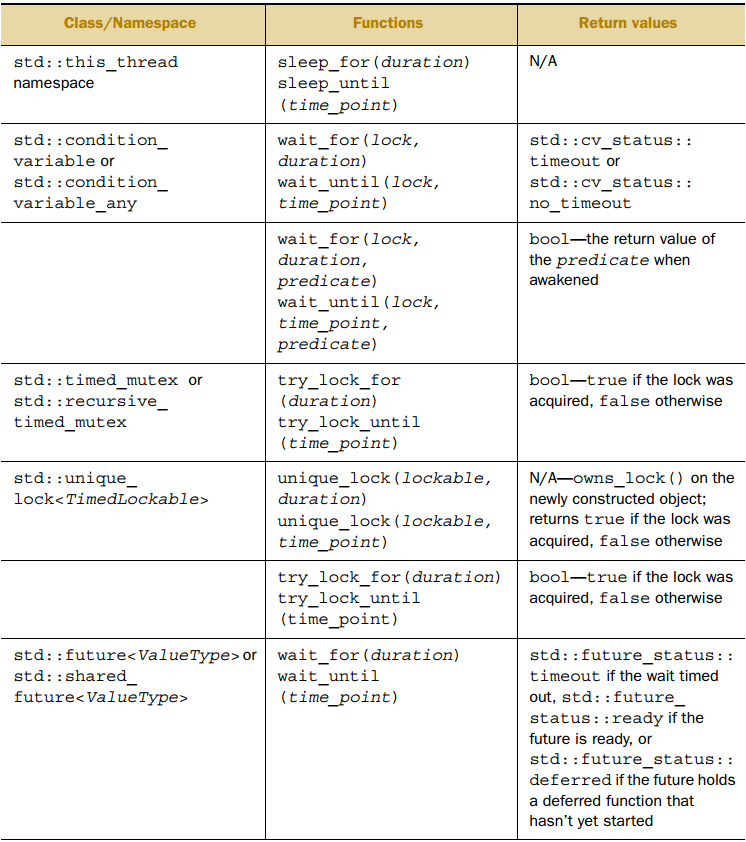
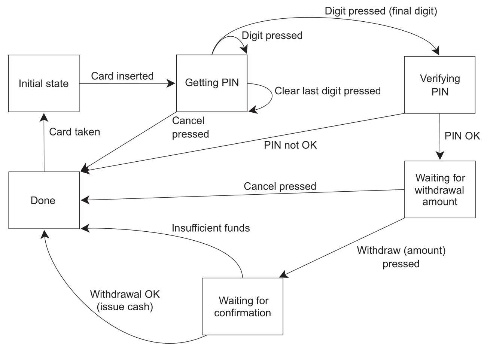

# 等待一个事件或其他条件

一个线程要等待另一个线程完成任务，确定完成任务的方法有几种。

- 第一种是持续检查  mutex，这种方法显然很浪费资源。
- 第二种是每隔一段时间进行一次检查。

```
bool flag;
std::mutex m;

void f()
{
	std::unique_lock<std::mutex> l(m);
	while (!flag)
	{
		l.unlock();
		std::this_thread::sleep_for(std::chrono::milliseconds(100)); //@ 休眠100ms
																	 //@ 休眠期间其他线程就有机会获取mutex并设置flag
		l.lock();
	}
}
```

但很难确定适当的休眠时间，过长（会直接影响程序行为，很少见）过短（相当于没有，一样浪费资源）都不好。

- 第三种方案是使用条件变量。

## 条件变量

标准库对条件变量提供了两种实现：std::condition_variable 和 std::condition_variable_any，前者仅限和 std::mutex 工作，而后者可以与任何满足最低标准的  mutex 工作（因此加上 _any 的后缀），更通用也意味着更大的开销，因此一般首选使用前者。

```
std::mutex m;
std::condition_variable cv;
std::string data;
bool ready = false;
bool processed = false;

void f()
{
	std::unique_lock<std::mutex> locker(m);
	cv.wait(locker, [] {return ready; });
	data += " after processing...";
	processed = true;
	locker.unlock();
	cv.notify_one();
}

int main()
{
	std::thread t(f);
	data = "data";

	//@ 使用{}包围是为了给 lock_guard 创建一个局部作用域
	{
		std::lock_guard<std::mutex> locker(m);
		data += " ready";
		ready = true;
		cv.notify_one();   //@ 唤醒 cv.wait
	}
	{
		std::unique_lock<std::mutex> locker(m);
		cv.wait(locker, [] {return processed; });
	}

	std::cout << data << "\n";
	t.join();
}
```

- wait() 中加入了 lambda 表达式用于判断相应的条件是否真正的达成，这是为了避免虚假唤醒导致的错误。
- wait() 传入的参数只能是 std::unique_lock 而不可以是 std::lock_guard：
  - lock_guard 没有 lock 和 unlock 接口，而 unique_lock 提供了相应的接口。
  - 在 wait() 函数之前，使用互斥锁保护了，如果 wait 的条件没有达成，wait() 函数会先调用互斥锁的 unlock() 函数，然后再将自己休眠，在被唤醒后，又会继续持有锁。

## 用条件变量实现线程安全的 queue

和 std::stack 一样，std::queue  的接口设计存在固有竞争，因此需要将 front 和 pop 合并成一个函数（就像合并 std::stack 的 top 和 pop）。这里提供了 pop 的两个变种 ：

- try_pop 总会直接返回（即使没有可弹出的值）。
- wait_and_pop 等待有值可检索才返回。

```
#include <mutex>
#include <condition_variable>
#include <queue>

template<typename T>
class threadsafe_queue
{
	mutable std::mutex m;
	std::queue<T> q;
	std::condition_variable cv;
public:
	threadsafe_queue() {}
	threadsafe_queue(const threadsafe_queue& rhs)
	{
		std::lock_guard<std::mutex>l(m);
		q = rhs.q;
	}

	void push(T x)
	{
		std::lock_guard<std::mutex>l(m);
		q.push(std::move(x));
		cv.notify_one();
	}

	void wait_and_pop(T &x)
	{
		std::unique_lock<std::mutex> l(m);
		cv.wait(l, [this] {return !q.empty(); });
		x = std::move(q.front());
		q.pop();
	}

	std::shared_ptr<T> wait_and_pop()
	{
		std::unique_lock<std::mutex> l(m);
		cv.wait(l, [this] {return !q.empty(); });
		std::shared_ptr<T> res(std::make_shared<T>(std::move(q.front())));
		q.pop();
		return res;
	}

	bool try_pop(T& x)
	{
		std::lock_guard<std::mutex>l(m);
		if (q.empty())
			return false;
		x = std::move(q.front());
		return true;
	}

	std::shared_ptr<T> try_pop()
	{
		std::lock_guard<std::mutex>l(m);
		if (q.empty())
			return false;
		std::shared_ptr<T> res(std::make_shared<T>(std::move(q.front())));
		return true;
	}

	bool empty() const
	{
		std::lock_guard<std::mutex> l(m);
		return q.empty();
	}
};
```

# 使用期值等待一次性事件

`<future>` 头文件中包含了以下几个类和函数：

- Providers 类：std::promise, std::package_task
- Futures 类：std::future , shared_future
- Providers 函数：std::async()
- 其他类型：std::future_error, std::future_errc, std::future_status, std::launch

标准库提供了只能关联一个事件的唯一期值 future 和能关联多个事件的共享期值 std::shared_future。

最简单的一次性事件就是运行在后台的计算结果，而 std::thread 不能获取返回值：

```
int f()
{
	return 1;
}

int main()
{
	std::thread t(f); //@ 如何读取f的返回值？
	t.join();
	
	return 0;
}
```

## future

- future::get 会一直阻塞，直到获取到结果或异步任务抛出异常。
- future::share 允许 move，但是不允许拷贝。future::share  通过引用计数的方式实现了多实例共享同一状态，但有计数就伴随着同步开销(无锁的原子操作也是有开销的)，性能会稍有下降。因此  C++11 要求程序员显式调用该函数，以表明用户对由此带来的开销负责。
- future::wait 一直等待直到数据就绪。数据就绪时，通过 get 函数，无等待即可获得数据。
- future::wait_for 和 future::wait_until 主要是用来进行超时等待的。future::wait_for 等待指定时长，future::wait_until 则等待到指定的时间点。返回值有 3 种状态：
  - ready，数据已就绪，可以通过get获取了。
  - timeout，超时，数据还未准备好。
  - deferred，这个和 std::async 相关，表明无需 wait，异步函数将在 get 时执行。

- future::valid 判断当前实例是否有效。future 主要是用来获取异步任务结果的，作为消费方出现，单独构建出来的实例没意义，因此为 false。当与其它生产方(Provider)通过共享状态关联后，才会变得有效，future 才会发挥实际的作用。C++11 中有下面几种 Provider，从这些 Provider 可获得有效的 future 实例：
  - std::async
  - promise::get_future
  - packaged_task::get_future

- 共享状态
  - 共享状态其本质就是单生产者-单消费者的多线程并发模型。
  - 无论是 promise 还是 packaged_task 都是通过共享状态，实现与 future 通信的。

### shared_future

future 调用 future::get 后就无法再次 future::get，也就是说只能获取一次数据，此外还会导致所在线程与其他线程数据不同步。std::shared_future 就可以解决此问题。

```
std::promise<int> ps;
std::future<int> ft(ps.get_future());
assert(ft.valid());
std::shared_future<int> sf(std::move(ft));
assert(!ft.valid());
assert(sf.valid());
```

也可以直接构造：

```
std::promise<int> ps;
//@ std::future隐式转换为std::shared_future
std::shared_future<int> sf(ps.get_future());
```

用 future::share 可以直接生成 future::share，这样就可以直接用 auto 简化声明 std::shared_future。

```
std::promise<int> ps;
auto sf = ps.get_future().share();
```

每一个 std::shared_future 对象上返回的结果不同步，为了避免多线程访问同一 std::shared_future  对象时的数据竞争就必须加锁保护。更好的方法是给每个线程拷贝一个 std::shared_future 对象，这样就可以安全访问而无需加锁。

## async

使用 std::async 可以启动一个异步任务，它返回一个持有计算结果的 future，通过 future::get 即可阻塞线程，直到期值的状态为 ready 并返回该结果。

```
int f()
{
	return 1;
}

int main()
{
	std::future<int> ft = std::async(f);
	std::cout << ft.get() << "\n"; //@ 1
}
```

std::async 和 std::thread 一样支持额外的函数参数：

```
//@ 函数
int f(int);
auto ft = std::async(f, 42);

//@ 成员函数
struct A {
	int x{ 0 };
	int f(int)
	{
		x++;
		return 1;
	}
};

A a;
auto ft1 = std::async(&A::f, &a, 42); //@ 调用 p->f(42),p是指向a的对象
auto ft2 = std::async(&A::f, a, 42); //@ 调用 tmpa.f(42),tmpa是a的副本

									 //@ 函数对象
struct A {
	int operator()(int);
};

A a;
auto ft1 = std::async(A(), 42); //@ 调用tmpa(42)，tmpa由A的移动构造函数获得
auto ft2 = std::async(std::ref(a), 42); //@ 调用a(42)
```

std::async 还可以设置第一个参数为线程的创建策略：

- std::launch::async：函数必须异步执行，即运行在不同的线程上。
- std::launch::deferred：当其它线程调用 future::get 时，将调用非异步形式。
- std::launch::async | std::launch::deferred ：不指定时的默认启动策略是对两者进行或运算的结果。

```
int f();
auto ft1 = std::async(std::launch::async, f);
auto ft2 = std::async(std::launch::deferred, f);
auto ft3 = std::async(std::launch::async | std::launch::deferred, f);
```

## promise

promise<T> 是一个模板类：

- T 为 promise 对象保存的值的类型，R 可以是 void 类型，此时 promise::set_value 不接受任何参数，仅用于通知关联的 future::get 解除阻塞。
- promise 保存的值可被与之关联的 future 读取，读取操作可以发生在其它线程。
- promise 允许 move 语义(右值构造，右值赋值)，但不允许拷贝(拷贝构造、赋值)，[future](https://en.cppreference.com/w/cpp/thread/future)  亦然。
- promise 和 future 合作共同实现了多线程间通信。

### 设置 std::promise 的值

promise::set_value 可以设置 promise 中保存的值，该值最终会被与之关联的 future::get 读取到。

promise::set_value 只能被调用一次，多次调用会抛出 future_error 异常。事实上 promise::set_value 函数会改变 promise 的状态为 ready，再次调用时发现状态已要是 ready 了，则抛出异常：

```
#include <iostream> 
#include <thread>  
#include <string>   
#include <future>   
#include <chrono>  
using namespace std::chrono;

void read(std::future<std::string> *future) {
	//@ future会一直阻塞，一直到有值到来
	std::cout << __func__<<" output: "<<future->get() << std::endl;
}

int main() 
{
	//@ promise 相当于生产者
	std::promise<std::string> promise;
	//@ future 相当于消费者, 右值构造
	std::future<std::string> future = promise.get_future();
	//@ 另一线程中通过future来读取promise的值
	std::thread t(read, &future);
	//@ 让read等一会儿:)
	std::this_thread::sleep_for(seconds(1));

	promise.set_value("hello future");
	t.join();

	return 0;
}
```

- 在 promise 构造时，promise 对象会与共享状态关联起来，这个共享状态可以存储一个 T 类型的值或者一个由 std::exception 派生出来的异常值。
- 通过 promise::get_future 调用获得的 future  与 promise 共享相同的共享状态。

### 当 std::promise 不设置值

如果 promise 直到销毁时，都未设置过任何值，则 promise 会在析构时自动设置为 future_error，这会造成 future::get 抛出 future_error 异常。

```
void read(std::future<int> future)
{
	try {
		future.get();
	}
	catch (std::future_error &e) {
		std::cerr << "error code:" << e.code() << "\n" << "error info:" << e.what() << std::endl;
	}
}

int main() {
	std::thread thread;
	{
		std::promise<int> promise;
		thread = std::thread(read, promise.get_future());
	}
	thread.join();

	return 0;
}
```

### 将异常存储于期值中

通过 promise::set_exception 函数可以设置自定义异常，该异常最终会被传递到 future，并在其 future::get 函数中被抛出。

```
int f(int x)
{
	if (x < 0)
	{
		throw std::out_of_range("x < 0");
	}
	return 1;
}

int main()
{
	std::promise<int> ps;
	auto ft = ps.get_future();
	std::thread t([&ps]
	{
		try
		{
			ps.set_value(f(-1)); //@ 此时还没有存储异常
		}
		catch (...)
		{
			ps.set_exception(std::current_exception()); //@ 存储异常
		}
	});
	t.join();
	ft.get();

	return 0;
}
```

promise 支持自定义异常：

```
void catch_error(std::future<void> &future) {
	try {
		future.get();
	}
	catch (std::logic_error &e) {
		std::cerr << "logic_error: " << e.what() << std::endl;
	}
}

int main() 
{
	std::promise<void> promise;
	std::future<void> future = promise.get_future();

	std::thread thr(catch_error, std::ref(future));
	//@ 自定义异常需要使用make_exception_ptr转换一下
	promise.set_exception(
		std::make_exception_ptr(std::logic_error("caught")));

	thr.join();
	return 0;
}
```

### std::promise 所在线程退出

promise 支持定制线程退出时的行为： 

- promise::set_value_at_thread_exit
  设置共享状态的值，但是不将共享状态的标志设置为 ready，当线程退出时该 promise 对象会自动设置为 ready。如果某个 future  对象与该 promise 对象的共享状态相关联，并且该 future 正在调用 future::get，则调用 future::get 的线程会被阻塞，当线程退出时，调用 future::get 的线程解除阻塞，同时返回 promise::set_value_at_thread_exit 所设置的值。注意，该函数已经设置了 promise 共享状态的值
- promise::set_exception_at_thread_exit
  线程退出时，future 则抛出该函数指定的异常。

## packaged_task

packaged_task 对一个函数或可调用对象绑定一个期望，当 packaged_task 的对象被调用时，它就会调用相关函数或者可调用对象，将期望状态设置为就绪，返回值也会被存储为相关数据。

- packaged_task 的模板参数是一个函数签名，当实例化一个 packaged_task 对象时，需要传入一个函数或者可调用对象，这个函数或可调用对象需要指定能接收指定的参数和返回可转换为指定返回类型的值。
- packaged_task 支持 move，但不支持拷贝。

```
int sum(int a, int b) {
	return a + b;
}

int main() {
	std::packaged_task<int(int, int)> task(sum);
	std::future<int> future = task.get_future();
	std::thread t(std::move(task), 1, 2);
	//@ 等待异步计算结果
	std::cout << "1 + 2 = " << future.get() << std::endl;

	t.join();
	return 0;
}
```

### packaged_task::valid

packaged_task 除了可以通过可调用对象构造外，还支持缺省构造。但此时构造的对象不能直接使用，需通过右值赋值操作设置了可调用对象或函数后才可使用。判断一个 packaged_task 是否可使用，可通过其成员函数 packaged_task::valid 来判断。

```
int main() {
	std::packaged_task<void()> task; //@ 缺省构造、默认构造
	std::cout << std::boolalpha << task.valid() << std::endl; //@ false

	std::packaged_task<void()> task2(std::move(task)); //@ 移动构造
	std::cout << std::boolalpha << task.valid() << std::endl; //@ false

	task = std::packaged_task<void()>([]() {});  //@ 移动赋值, 可调用对象
	std::cout << std::boolalpha << task.valid() << std::endl; //@ true

	return 0;
}
```

### packaged_task::operator()

packaged_task::operator() 的返回值是 void，即无返回值。因为 packaged_task 的设计主要是用来进行异步调用，因此 packaged_task::operator() 的计算结果是通过 future::get 来获取的。该函数会忠实地将计算结果反馈给 future，即使抛出异常(此时 future::get 也会抛出同样的异常)。

```
int main() {
	std::packaged_task<void()> convert([]() {
		throw std::logic_error("will catch in future");
	});
	std::future<void> future = convert.get_future();

	convert(); //@ 异常不会在此处抛出

	try {
		future.get();
	}
	catch (std::logic_error &e) {
		std::cerr << typeid(e).name() << ": " << e.what() << std::endl;
	}

	return 0;
}
```

### std::packaged_task 所在线程退出时

packaged_task::make_ready_at_thread_exit 函数接收的参数与 packaged_task::operator() 一样，行为也一样。只有一点差别，那就是不会将计算结果立刻反馈给 future，而是在其执行时所在的线程结束后，future::get 才会取得结果。

### std::packaged_task::reset

与 promise 不一样，promise 仅可以执行一次 promise::set_value 或 promise::set_exception 函数，但 packaged_task 可以执行多次，其奥秘就是 packaged_task::reset 函数。packaged_task::reset  重新构造了 promise，packaged_task::reset  操作并不会影响之前调用的 packaged_task::make_ready_at_thread_exit 结果，也即之前的定制的行为在线程退出时仍会发生。

### 多线程GUI更新示例

很多GUI架构要求用指定线程更新GUI，如果另一个线程要更新GUI，就需要发送信消息给指定线程。使用 packaged_task 即可实现此功能。

```
//@ 更新GUI的线程
void gui_thread()
{
	while (!gui_shutdown_message_received()) //@ 未收到终止消息则一直轮询
	{
		process_gui_message(); //@ 处理收到的消息
		std::packaged_task<void()> pt;
		{
			std::lock_guard<std::mutex> l(m);
			if (d.empty())
				continue; //@ 任务队列为空时，继续循环
			pt = std::move(d.front());
			d.pop_front();
		}
		pt(); //@ 执行任务，当任务执行完成时，其状态会被设置为就绪状态
	}
}

std::thread t(gui_thread);

//@ 将一个任务传入队列
template<typename F>
std::future<void> postTask(F f)
{
	std::packaged_task<void()> pt(f); //@ 提供一个打包好的任务
	std::future<void> res = pt.get_future(); //@ 获取期望
	std::lock_guard<std::mutex> l(m);
	d.push_back(std::move(pt));
	return res;
}
```

# 限定等待时间

超时方式：

- 一种是“时延”的超时方式，需要指定一段时间(例如，30毫秒)；处理持续时间的变量以 _for 作为后缀。
- 另一种是“绝对”超时方式，需要指定一个时间点(例如，2020年1月30日)；处理绝对时间的变量以 _until 作为后缀。

## 时钟

对于标准库来说，时钟就是时间信息源。具体来说，时钟是提供了四种信息的类：

- 当前时间：如： chrono::system_clock::now()
- 时间类型：chrono::time_point
- 时钟节拍（一个嘀嗒的周期）：一般一秒有25个节拍，一个周期则为 std::ratio
- 通过时钟节拍的分布，判断时钟是否稳定（steady，匀速）：
  - chrono::system_clock 是不稳定的，它代表了系统时钟的“实际时间”，并且提供了函数可将时间点转化为 time_t 类型的值。因为时钟是可调的，这种调节可能造成的是，首次调用 now() 返回的时间要早于上次调用 now() 所返回的时间，这就违反了节拍频率的均匀分布。
  - chrono::steady_clock  能够提供一个稳定时钟。
  - chrono::high_resolution_clock 最小节拍最高精度的时钟。

打印当前的系统时间：

```
#include <iostream>
#include <ctime>
#include <chrono>
#include <iomanip>

int main()
{
	std::chrono::system_clock::time_point now = std::chrono::system_clock::now();
	std::time_t now_c = std::chrono::system_clock::to_time_t(now);
	//@  %F即%Y-%m-%d，%T即%H:%M:%S
	std::cout << std::put_time(std::localtime(&now_c), "%F %T") << "\n";
}
```

## chrono::duration

标准库提供了表示时间间隔类型的 chrono::duration <>,它是一个函数模板：

- 第一个模板参数是一个类型表示(比如，int，long 或 double)。
- 第二个模板参数是指定部分，表示每一个单元所用秒数。

```
std::chrono::duration<short, std::ratio<60, 1>> //@ 分钟级
std::chrono::duration<double, std::ratio<1, 1000>> //@ 毫秒级
```

标准库在 std::chrono 命名空间内，为延时变量提供一系列预定义类型：

- chrono::nanoseconds (纳秒)
- chrono::microseconds (微秒)
- chrono::milliseconds (毫秒) 
- chrono::seconds (秒)
- chrono::minutes (分)
- chrono::hours (时)

不同 chrono::duration 之间的转换使用 chrono::duration_cast<> ：

```
std::chrono::milliseconds ms(54802);
//@ 这里的结果就是截断的，而不是进行了舍入，所以s最后的值将为54
std::chrono::seconds s = std::chrono::duration_cast<std::chrono::seconds>(ms);
```

在时延中可以通过 count() 成员函数获得单位时间的数量。例如：

```
std::chrono::milliseconds(1234).count(); //@ 结果是 1234
```

chrono::duration 支持四则运算：

```
using namespace std::chrono_literals;
auto x = 1h;
auto y = 15min;
auto z = x - 2 * y;
std::cout << z.count(); //@ 30
```

使用 chrono::duration  即可设置等待时间：

```
std::future<int> f=std::async(some_task);
if(f.wait_for(std::chrono::milliseconds(35))==std::future_status::ready)
  do_something_with(f.get());
```

- 基于时延的等待是使用内部库提供的稳定时钟，来进行计时的；所以，即使系统时钟在等待时被调整(向前或向后)，35毫秒的时延在这里意味着，的确耗时35毫秒。

- 当然，难以预料的系统调度和不同操作系统的时钟精度都意味着：在线程中，从调用到返回的实际时间可能要比35毫秒长。

C++14 的 std::chrono_literals 提供了表示时间的后缀：

```
using namespace std::chrono_literals;
auto x = 45min; //@ 等价于std::chrono::minutes(45)
std::cout << x.count(); //@ 45
auto y = std::chrono::duration_cast<std::chrono::seconds>(x);
std::cout << y.count(); //@ 2700
auto z = std::chrono::duration_cast<std::chrono::hours>(x);
std::cout << z.count(); //@ 0（转换会截断）
```

标准库通过字面值运算符模板实现此后缀功能：

```
constexpr std::chrono::minutes operator ""min(unsigned long long m)
{
    return std::chrono::minutes(m);
}
```

## chrono::time_point

 chrono::time_point<> 是表示时间点的模板：

- 第一个参数用来指定所要使用的时钟。
- 第二个函数参数用来表示时间的计量单位。

```
std::chrono::time_point<std::chrono::system_clock, std::chrono::seconds>
```

可以通过对指定 chrono::time_point 类型使用 chrono::time_since_epoch 来获取时间戳。这个成员函数会返回一个时延值，这个时延值是指定时间点到时钟的 unix 时间戳锁用时：

```
const auto p1 = std::chrono::system_clock::now();
std::cout << "hours since epoch: "
    << std::chrono::duration_cast<std::chrono::seconds>(
    p1.time_since_epoch()).count()
    << '\n';
```

chrono::time_point 可以加减 chrono::duration 来获得一个新的时间点：

```
using namespace std::chrono_literals;
auto x = std::chrono::high_resolution_clock::now();
auto y = x + 1s;
std::cout << std::chrono::duration_cast<std::chrono::milliseconds>(y - x).count();
```

两个 chrono::time_point 也能相减：

```
auto start = std::chrono::high_resolution_clock::now();
doSomething();
auto stop = std::chrono::high_resolution_clock::now();
std::cout << std::chrono::duration_cast<std::chrono::milliseconds>(stop - start).count();
```

使用绝对的时间点来设置等待时间：

```
std::condition_variable cv;
bool done;
std::mutex m;

bool wait_loop()
{
    const auto timeout = std::chrono::steady_clock::now() + std::chrono::milliseconds(500);
    std::unique_lock<std::mutex> l(m);
    while (!done)
    {
        if (cv.wait_until(l, timeout) == std::cv_status::timeout) break;
    }
    return done;
}
```

## 接受 timeout 的函数

timeout 可以用于休眠，比如 std::this_thread::sleep_for 和 std::this_thread::sleep_until，此外  timeout 还能配合条件变量、期值甚至 mutex 使用。

std::mutex  和 std::recursive_mutex  不支持 timeout，而 std::timed_mutex 和 std::recursive_timed_mutex 支持，它们提供了try_lock_for  和 try_lock_until。

支持 timeout 的函数有：



# 使用同步操作简化代码

## 使用期值进行函数式编程

```
template<typename T>
std::list<T> quicksort(std::list<T> lst)
{
	if (lst.empty())
		return lst;
	std::list<T> res;
	//@ std::list::splice用于转移另一个list中的元素到目标list
	res.splice(res.begin(), lst, lst.begin()); //@ 将lst的首元素移到res中
	const T& firstVl = *res.begin();
	//@ std::partition按条件在原容器上划分为两部分
	//@ 并返回划分点（第一个不满足条件元素）的迭代器
	auto it = std::partition(lst.begin(), lst.end(), [&](const T& x) {return x < firstVl; });
	std::list<T> low;
	low.splice(low.end(), lst, lst.begin(), it); //@ 转移左半部分到low
	auto left(quicksort(std::move(low)));
	auto right(quicksort(std::move(lst)));
	res.splice(res.end(), right);
	res.splice(res.begin(), left);
	return res;
}
```

使用期值实现并行的快速排序：

```
template<typename T>
std::list<T> quicksort_fp(std::list<T> lst)
{
	if (lst.empty())
		return lst;
	std::list<T> res;
	res.splice(res.begin(), lst, lst.begin());
	const T& firstVl = *res.begin();
	auto it = std::partition(lst.begin(), lst.end(), [&](const T& x) {return x < firstVl; });
	std::list<T> low;
	low.splice(low.end(), lst, lst.begin(), it);
	//@ 用另一个线程对左半部分排序
	std::future<std::list<T>> left(std::async(&quicksort_fp<T>, std::move(low)));
	auto right(quicksort_fp(std::move(lst)));
	res.splice(res.end(), right);
	res.splice(res.begin(), left.get()); // 获取future中的值
	return res;
}
```

## 使用消息传递进行同步操作

CSP(Communicating Sequential Processer) 的思路很简单，如果没有共享数据，每个线程可以完全独立地思考，其行为取决于收到的消息。因此每个线程实际上是一个状态机，收到一条消息时就以某种方式更新状态，并且还可能发送消息给其他线程。

真正的 CSP 没有共享数据，所有通信通过消息队列传递，但由于 C++ 线程共享地址空间，因此无法强制实现这个要求。所以这就需要引入一些约定，作为应用或者库的作者，必须确保在线程间不会共享数据（当然为了通信，必须共享消息队列）。

考虑实现一个ATM应用，它需要处理取钱时和银行的交互，并控制物理机器对银行卡的反应。一个处理方法是分三个线程，分别处理物理机器、ATM逻辑、与银行的交互，线程间通过消息通讯而非共享数据，比如插卡时机器线程发送消息给逻辑线程，逻辑线程返回一条消息通知机器线程可以取出多少钱，一个简单的ATM逻辑的状态机建模如下：



这个状态机可以用一个类实现，类中有一个表示状态的成员函数：

```
struct card_inserted
{
    std::string account;
};

class atm
{
    messaging::receiver incoming;
    messaging::sender bank;
    messaging::sender interface_hardware;
    void (atm::*state)();
    std::string account;
    std::string pin;

    void waiting_for_card()
    {
        interface_hardware.send(display_enter_card());
        incoming.wait()
        .handle<card_inserted>([&](const card_inserted& msg)
        {
            account = msg.account;
            pin = "";
            interface_hardware.send(display_enter_pin());
            state = &atm::getting_pin;
        });
    }

    void getting_pin();
public:
    void run()
    {
        state = &atm::waiting_for_card;
        try
        {
            for (;;) (this->*state)();
        }
        catch(const messaging::close_queue&) {}
    }
};


void atm::getting_pin()
{
    incoming.wait()
    .handle<digit_pressed>([&](const digit_pressed& msg)
    {
        const unsigned pin_length = 4;
        pin += msg.digit;
        if (pin.length() == pin_length)
        {
            bank.send(verify_pin(account, pin, incoming));
            state = &atm::verifying_pin;
        }
    })
    .handle<clear_last_pressed>([&](const clear_last_pressed& msg)
    {
        if (!pin.empty()) pin.resize(pin.length() - 1);
    })
    .handle<cancel_pressed>([&](const cancel_pressed& msg)
    {
        state = &atm::done_processing;
    });
}
```

这里不需要考虑同步和并发的问题，只要考虑在某个点接受和发送的消息。这个 ATM 逻辑的状态机与系统的其他部分各自运行在独立的线程上，这种设计方式称为 actor model，系统中有多个独立的 actor，actor 之间可以互相发送消息但不会共享状态，这种方式可以极大简化并发系统的设计。

# std::experimental

## std::experimental::future

并发TS 中提供了 experimental::promise 和 experimental::packaged_task，与标准库唯一不同的是，它们返回 experimental::future，这个期值提供了持续性。

需要处理 future 的结果时，必须等待其调用成员函数，这很不方便。持续性带来的好处是数据就绪就进行处理，调用 experimental::future::then 即可添加持续性。

```
int f(std::experimental::future<int>);

std::experimental::future<int> eft;
auto ft1 = eft(); 
/*
std::experimental::future由本身的构造函数生成
添加持续性并返回新的期值，该期值持有持续性调用的结果
与std::async不同，不能传入f的参数
因为参数已经在运行库中定义为了一个就绪的期值
这里f的返回int，因此参数就是std::experimental::future<int>
*/
auto ft2 = ft1.then(f);
//@ then后原期值就无效了
assert(!ft1.valid());
assert(ft2.valid());
```

std::async 只能返回 future，如果想返回 experimental::future 则需要手动实现一个新的 async：

```
template<typename F>
std::experimental::future<decltype(std::declval<F>()())>
new_async(F&& func)
{
    std::experimental::promise<decltype(std::declval<F>()())> p;
    auto ft = p.get_future();
    std::thread t(
        [p = std::move(p), f = std::decay_t<F>(func)]() mutable {
            try {
                p.set_value_at_thread_exit(f());
            } catch(...) {
                p.set_exception_at_thread_exit(std::current_exception());
            }
        }
    );
    t.detach();
    return ft;
}
```

假如要实现一个登录逻辑，将用户名和密码发送给后台验证，取得用户信息后更新到显示界面，串行实现如下：

```
void process_login(const std::string& username, const std::string& password)
{
    try {
        const user_id id = backend.authenticate_user(username, password);
        const user_data info_to_display = backend.request_current_info(id);
        update_display(info_to_display);
    } catch(std::exception& e) {
        display_error(e);
    }
}
```

为了不阻塞 UI 线程，就需要异步实现：

```
std::future<void> process_login(const std::string& username, const std::string& password)
{
    return std::async(std::launch::async, [=] () {
        try {
            const user_id id = backend.authenticate_user(username, password);
            const user_data info_to_display = backend.request_current_info(id);
            update_display(info_to_display);
        } catch(std::exception& e) {
            display_error(e);
        }
    });
}
```

但这个实现仍然会阻塞UI线程，为此就需要持续性的机制，每个任务完成后连接到前一个任务上：

```
std::experimental::future<void> process_login(const std::string& username, const std::string& password)
{
    return new_async([=] () {
        return backend.authenticate_user(username, password);
    })
    .then([] (std::experimental::future<user_id> id) {
        return backend.request_current_info(id.get());
    })
    .then([] (std::experimental::future<user_data> info_to_display) {
        try {
            update_display(info_to_display.get());
        } catch(std::exception& e) {
            display_error(e);
        }
    });
}
```

这样就是在异步函数链上就不存在阻塞了。最后这里还可以用泛型 lambda 来简化代码：

```
std::experimental::future<void> process_login(const std::string& username, const std::string& password)
{
    return backend.async_authenticate_user(username, password)
    .then([] (auto id) {
        return backend.async_request_current_info(id.get());
    })
    .then([] (auto info_to_display) {
        try {
            update_display(info_to_display.get());
        } catch(std::exception& e) {
            display_error(e);
        }
    });
}
```

除了 experimental::future，支持持续性的还有 experimental::shared_future：

```
auto ft1 = new_async(some_function).share();
auto ft2 = ft1.then([] (std::experimental::shared_future<some_data> data) {
    do_stuff(data);
});
auto ft3 = ft1.then([] (std::experimental::shared_future<some_data> data) {
    return do_other_stuff(data);
});
```

## std::experimental::when_all

使用 std::async 从多个期值中获取结果：

```
std::future<FinalResult> process_data(std::vector<MyData>& vec)
{
    const size_t chunk_size = whatever;
    std::vector<std::future<ChunkResult>> res;
    for (auto begin = vec.begin(), end = vec.end(); beg! = end;)
    {
        const size_t remaining_size = end - begin;
        const size_t this_chunk_size = std::min(remaining_size, chunk_size);
        res.push_back(std::async(process_chunk, begin, begin + this_chunk_size));
        begin += this_chunk_size;
    }
    return std::async([all_results = std::move(res)] () {
        std::vector<ChunkResult> v;
        v.reserve(all_results.size());
        for (auto& f: all_results)
        {
            v.push_back(f.get()); //@ 这里会导致反复唤醒，增加了很多开销
        }
        return gather_results(v);
    });
}
```

使用 experimental::when_all 可以避免反复唤醒导致的开销，为其传入一组需要等待的期值，将返回一个新的期值。当传入的所有期值都就绪时，则返回的期值就绪：

```
std::experimental::future<FinalResult> process_data(std::vector<MyData>& vec)
{
    const size_t chunk_size = whatever;
    std::vector<std::experimental::future<ChunkResult>> res;
    for (auto begin = vec.begin(), end = vec.end(); beg! = end;)
    {
        const size_t remaining_size = end - begin;
        const size_t this_chunk_size = std::min(remaining_size, chunk_size);
        res.push_back(new_async(process_chunk, begin, begin + this_chunk_size));
        begin += this_chunk_size;
    }
    return std::experimental::when_all(res.begin(), res.end())
    .then([] (std::future<std::vector<std::experimental::future<ChunkResult>>> ready_results)
    {
        std::vector<std::experimental::future<ChunkResult>>
        all_results = ready_results.get();
        std::vector<ChunkResult> v;
        v.reserve(all_results.size());
        for (auto& f: all_results)
        {
            v.push_back(f.get());
        }
        return gather_results(v);
    });
}
```

## std::experimental::when_any

在传入的期值中有一个就绪时，则 experimental::when_any 返回的期值就绪：

```
std::experimental::future<FinalResult>
find_and_process_value(std::vector<MyData>& data)
{
    const unsigned concurrency = std::thread::hardware_concurrency();
    const unsigned num_tasks = (concurrency > 0) ? concurrency : 2;
    std::vector<std::experimental::future<MyData*>> res;
    const auto chunk_size = (data.size() + num_tasks - 1) / num_tasks;
    auto chunk_begin = data.begin();
    std::shared_ptr<std::atomic<bool>> done_flag = std::make_shared<std::atomic<bool>>(false);
    for (unsigned i = 0; i < num_tasks; ++i)
    { 
    	//@ 产生num_tasks个异步任务到res中
        auto chunk_end = (i < (num_tasks - 1)) ? chunk_begin + chunk_size : data.end();
        res.push_back(new_async([=] {
            for (auto entry = chunk_begin; !*done_flag && (entry != chunk_end); ++entry)
            {
                if (matches_find_criteria(*entry))
                {
                    *done_flag = true;
                    return &*entry;
                }
            }
            return (MyData**)nullptr;
        }));
        chunk_begin = chunk_end;
    }
    std::shared_ptr<std::experimental::promise<FinalResult>> final_result =
        std::make_shared<std::experimental::promise<FinalResult>>();

    struct DoneCheck {
        std::shared_ptr<std::experimental::promise<FinalResult>> final_result;

        DoneCheck(std::shared_ptr<std::experimental::promise<FinalResult>> final_result_)
        : final_result(std::move(final_result_)) {}

        void operator()(
            std::experimental::future<std::experimental::when_any_result<
                std::vector<std::experimental::future<MyData*>>>> res_param)
        {
            auto res = res_param.get();
            //@ 从就绪的期值中获取值
            MyData* const ready_result = res.futures[res.index].get(); 
            //@ 找到符合条件的值则处理结果并set_value
            if (ready_result)
            {
                final_result->set_value(process_found_value(*ready_result));
            }
            else
            {
                res.futures.erase(res.futures.begin() + res.index); //@ 否则丢弃值
                if (!res.futures.empty())
                { 
                	//@ 如果还有需要检查的值则再次调用when_any
                    std::experimental::when_any(res.futures.begin(), res.futures.end())
                    .then(std::move(*this));
                }
                else
                { 
                	//@ 如果没有其他期值则在promise中设置一个异常
                    final_result->set_exception(std::make_exception_ptr(std::runtime_error("Not found")));
                }
            }
        }
    };
    std::experimental::when_any(res.begin(), res.end()).then(DoneCheck(final_result));
    return final_result->get_future();
}
```

when_all 和 when_any 除了可以接收一对迭代器，也可以直接接受期值：

```
std::experimental::future<int> ft1 = new_async(f1);
std::experimental::future<std::string> ft2 = new_async(f2);
std::experimental::future<double> ft3 = new_async(f3);
std::experimental::future<
    std::tuple<
        std::experimental::future<int>,
        std::experimental::future<std::string>,
        std::experimental::future<double>>> res =
    std::experimental::when_all(std::move(ft1), std::move(ft2), std::move(ft3));
```

## std::experimental::latch

experimental::latch  用一个计数器值构造，等待事件发生时就调用 experimental::latch::count_down 将计数器值减一，计数器值为0时则 experimental::latch::is_ready 返回 true，如果想让计数器减一并阻塞至0则可以调用 experimental::latch::count_down_and_wait 用 experimental::latch 等待事件。

```
void f()
{
    const unsigned thread_count = ...;
    std::experimental::latch done(thread_count); //@ 用计数器值构造latch
    my_data data[thread_count];
    std::vector<std::future<void>> threads;
    for (unsigned i = 0; i < thread_count; ++i)
    {
        threads.push_back(std::async(std::launch::async, [&, i] {
            data[i] = make_data(i);
            done.count_down(); //@ 在进行下一步之前先递减计数器
            do_more_stuff();
        }));
    }
    done.wait(); //@ 等待至计数器为0
    process_data(data, thread_count);
}
```

## std::experimental::barrier

一组处理数据的线程，处理过程中独立，无需同步，但在处理下一项数据前，必须要求所有线程完成任务。experimental::barrier 就可以用于处理这种情况，它用线程的数量构造，调用 experimental::barrier::arrive_and_wait 会阻塞至所有线程完成任务，当最后一个线程完成任务时，所有线程被释放，barrier 被重置。如果想从线程集中移除线程，可以让该线程在 barrier 上调用 experimental::barrier::arrive_and_drop 。

```
result_chunk process(data_chunk);
std::vector<data_chunk> divide_into_chunks(data_block data, unsigned num_threads);

void process_data(data_source& source, data_sink& sink) //@ 源数据和输出数据
{
    const unsigned concurrency = std::thread::hardware_concurrency();
    const unsigned num_threads = (concurrency > 0) ? concurrency : 2;
    std::experimental::barrier b(num_threads); // 构造barrier
    std::vector<joining_thread> threads(num_threads);
    std::vector<data_chunk> chunks;
    result_block res;
    for (unsigned i = 0; i < num_threads; ++i)
    {
        threads[i] = joining_thread([&, i] {
            while (!source.done()) //@ 循环至处理完所有任务
            {
                if (i == 0)
                { 
                	//@ 线程0拆分数据
                    data_block current_block = source.get_next_data_block();
                    chunks = divide_into_chunks(current_block, num_threads);
                }
                b.arrive_and_wait(); //@ 这里阻塞是因为其他线程必须等待线程0初始化
                res.set_chunk(i, num_threads, process(chunks[i])); //@ 更新结果到res
                b.arrive_and_wait(); //@ 这里阻塞是因为写入前线程0必须等待其他线程完成
                if (i == 0) sink.write_data(std::move(res)); //@ 只有线程0可以输出结果
            }
        });
    }
}
```

## std::experimental::flex_barrier

experimental::flex_barrier 比 experimental::barrier 更加灵活，但开销更大，此外 experimental::flex_barrier  还要多接受一个函数作为参数，当所有线程到达阻塞点时，由其中一个线程运行该函数。

下面用 experimental::flex_barrier 简化上面的例子：

```
void process_data(data_source& source, data_sink& sink)
{
    const unsigned concurrency = std::thread::hardware_concurrency();
    const unsigned num_threads = (concurrency > 0) ? concurrency : 2;
    std::vector<data_chunk> chunks;
    auto split_source = [&] {
        if (!source.done())
        {
            data_block current_block = source.get_next_data_block();
            chunks = divide_into_chunks(current_block, num_threads);
        }
    };
    split_source(); //@ 先调用上面的lambda拆分数据
    result_block res;
    std::experimental::flex_barrier sync(num_threads, [&] {
        sink.write_data(std::move(res)); //@ 每次迭代完成输出一次结果
        split_source(); //@ 并为下一次迭代拆分数据
        return -1; //@ 必须返回不小于-1的值且不抛出异常，-1表示线程数不变
        //@ 返回其他值则表示下一周期的线程数
    });
    std::vector<joining_thread> threads(num_threads);
    for (unsigned i = 0; i < num_threads; ++i)
    {
        threads[i] = joining_thread([&, i] {
            while (!source.done())
            {
                res.set_chunk(i, num_threads, process(chunks[i])); //@ 更新结果到res
                sync.arrive_and_wait(); //@ 只需要一个阻塞点
            }
        });
    }
}
```


