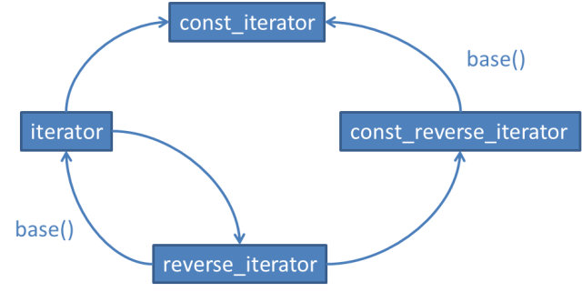
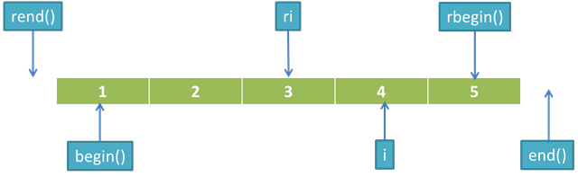

# iterator 优先于const_iterator、reverse_iterator 以及 const_reverse_iterator

对于容器类 `container<T>` 而言，

- iterator 的功效相当于 T*
- const_iterator 的功效相当于 const T*
- reverse_iterator 与 const_reverse_iterator 与前两者类似，只是按照反向遍历

从 iterator 到 const_iterator 和 reverse_iterator 存在隐式转换，从 reverse_iterator 到 const_iterator 也存在隐式转换。



通过 base() 可以将 reverse_iterator 转换 为 iterator，同样可以将 const_reversse_iterator 转换为 const_iterator，但是转换后的结果并不指向同一元素(有一个偏移量)。

# 使用 distance 和 advance 将容器的 const_iterator 转换成 iterator

对于大多数的容器，const_cast 并不能将 const_iterator 转换为  iterator。即使在某些编译器上可以将 vector 和 string 的 const_iterator 转换为 iterator，但存在移植性的问题

通过 distance 和 advance 将 const_iterator 转换为 iterator 的方法：

```
typedef std::deque<int> IntDeque;
typedef IntDeque::iterator Iter;
typedef IntDeque::const_iterator ConstIter;

IntDeque d(5, 10);
ConstIter ci;
ci = d.cbegin() + 1; // 使ci指向d
Iter i(d.begin());
std::advance(i, std::distance<ConstIter>(i, ci));
```

- std::distance 用以取得两个迭代器(它们指向同一个容器)之间的距离。
- std::advance 则用于将一个迭代器移动指定的距离。

# 正确理解由 reverse_iterator 的 base() 成员函数所产生的 iterator 的用法

使用 reverse_iterator 的 base() 成员函数所产生的 iterator 和原来的 reverse_iterator 之间有一个元素的偏移量。



容器的插入、删除和修改操作都是基于 iterator 的，所以对于 reverse_iterator，必须通过 base() 成员函数转换为 iterator 之后才能进行增删改的操作。

- 对于插入操作而言，新插入的元素都在 3 和 4 之间，所以可以直接使用 insert(ri.base()，xxx)。
- 对于修改和删除操作，由于 ri 和 ri.base() 并不指向同一元素，所以在修改和删除前，必须修正偏移量。

修正 ri 和 ri.base() 偏移量的做法：

```
	std::map<int, std::string> m{ { 0, "xxx" } };
	std::vector<int> v;
	v.reserve(5);

	for (int i = 1; i <= 5; ++i) 
		v.push_back(i);

	std::vector<int>::reverse_iterator ri = std::find(v.rbegin(), v.rend(), 3); //@ 使ri指向3
	std::vector<int>::iterator i(ri.base());
	fprintf(stdout, "%d\n", (*i)); //@ 4
	v.insert(i, 99);
	for (auto it = v.cbegin(); it != v.cend(); ++it) fprintf(stdout, "value: %d\n", *it); //@ 1 2 3 99 4 5

	v.clear(); v.reserve(5);
	for (int i = 1; i <= 5; ++i) v.push_back(i);
	ri = std::find(v.rbegin(), v.rend(), 3);
	v.erase((++ri).base());
	for (auto it = v.cbegin(); it != v.cend(); ++it) fprintf(stdout, "value: %d\n", *it); //@ 1 2 4 5
```

如果要在一个 reverse_iterator ri 指定的位置上插入新元素，则只需在 ri.base() 位置处插入元素即可。对于插入操作而言，ri 和 ri.base() 是等价的，ri.base() 是真正与 ri 对应的 iterator。

如果要在一个 reverse_iterator ri 指定的位置上删除一个元素，则需要在 ri.base() 前面的位置上执行删除操作。对于删除操作而言，ri 和 ri.base() 是不等价的，ri.base() 不是与 ri 对应的 iterator。

# 对于逐个字符的输入请考虑使用 istreambuf_iterator 

常用的 istream_iterator 内部使用的 `operator>>` 实际上执行了格式化的输入，每一次的 `operator>>` 操作都有很多的附加操作：

- 一个内部 sentry 对象的构造和析构(设置和清理行为的对象)
- 检查可能影响行为的流标志(比如 skipws)
- 检查可能发生的读取错误
- 出现错误时检查流的异常屏蔽标志以决定是否抛出异常

对于 istreambuf_iterator，它直接从流的缓冲区中读取下一个字符，不存在任何的格式化，所以效率相对 istream_iterator要高得多。

对于非格式化的输出，也可以考虑使用 ostreambuf_iterator 代替 ostream_iterator。（损失了格式化输出的灵活性） 。

```
//@ 把一个文本文件的内容拷贝到一个string对象中
std::ifstream inputFile("interestingData.txt");
inputFile.unsetf(std::ios::skipws); //@ 禁止忽略inputFile中的空格
std::string fileData((std::istream_iterator<char>(inputFile)), std::istream_iterator<char>()); 
//@ 速度慢

std::string fileData2((std::istreambuf_iterator<char>(inputFile)), std::istreambuf_iterator<char>()); //@ 速度快
```

`std::istream_iterator<char>` 对象使用 `operator>>` 从输入流中读取单个字符，而 `std::istreambuf_iterator<char>` 则直接从流的缓冲区中读取下一个字符。std::istreambuf_iterator 不会跳过任何字符，它只是简单地取回流缓冲区中的下一个字符，而不管它们是什么字符，因此用不着清除输入流的 skipws 标志。

同样地，对于非格式化的逐个字符输出过程，你也应该考虑使用 std::ostreambuf_iterator，它可以避免因使用std::ostream_iterator 而带来的额外负担。


