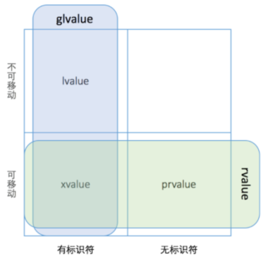

# 表达式的类型


- lvalue：左值，通常可以放在等号左边的表达式，有标识符，可以取地址
  - 变量，函数或数据成员的名字
  - 返回左值引用的表达式，如：++x，x = 1，cout <<'  '
  - 字符串字面量，如 "hello，world"
- rvalue：右值，通常只能放在等号右边的表达式
- gvalue：广义左值，generalized lvalue
- xvalue：将亡值，expiring lvalue
- prvalue：纯右值，pure rvalue，没有标识符，不可以取地址
  - 返回非引用类型的表达式，如：x++，x+1，make_shared<int>(42)
  - 除字符串字面量之外的字面量，如：42，true

右值引用的形式为：T&&。

```
template <typename U>
SharedPtr(SharedPtr<U>&& other) noexcept
{
    ptr_ = other.ptr_;
    if (ptr_)
    {
        shared_count_ = other.shared_count_;
        other.ptr_ = nullptr;
    }
}
```

other 本身是一个左值，但是它的类型是右值引用。

```
SharedPtr<Shape> ptr1{new Circle()};
SharedPtr<Shape> ptr2 = std::move(ptr1);
```

std::move 把一个左值引用强制转换成一个右值引用，并不改变其内容。可以将 std::move(ptr1)  看作是一个有名字的右值，为了跟无名的纯右值 prvalue 相区别，目前将这种表达式称为 xvalue，但是与 lvalue 不同，xvalue 仍然不能取地址。



# 生命周期和表达式类型

一个临时对象会在包含这个临时对象的完整表达式估值完成后，按生成顺序的逆序被销毁，除非有生命周期延长发生。

```
#include <stdio.h>

class Shape
{
public:
	virtual ~Shape() {}
};

class Circle : public Shape
{
public:
	Circle() { puts("Circle()"); }
	 ~Circle() { puts("~Circle()"); }
};

class Triangle : public Shape
{
public:
	Triangle() { puts("Triangle()"); }
	~Triangle() { puts("~Triangle()"); }
};

class Result
{
public:
	Result() { puts("Result()"); }
	~Result() { puts("~Result()"); }
};

Result process_shape(const Shape& shape1, const Shape& shape2)
{
	puts("process_shape()");
	return Result();
}

int main()
{
	puts("main()");
	process_shape(Circle(), Triangle());
	puts("something else");

	return 0;
}
```

结果：

```
main()
Triangle()
Circle()
process_shape()
Result()
~Result()
~Circle()
~Triangle()
something else
```

如果一个 prvalue 被绑定到一个引用上，它的生命周期则会延长到跟这个引用变量一样长。

```
Result&& r = process_shape(Circle(), Triangle());
```

结果：

```
main()
Triangle()
Circle()
process_shape()
Result()
~Circle()
~Triangle()
something else
~Result()
```

Result 的生成还是在原来的位置，但析构被延到了 main 的最后。

这条生命周期延长规则只对 prvalue 有效，而对 xvalue 无效，如果由于某种原因，prvalue 在绑定到引用以前已经变成了 xvalue，那生命周期就不会被延长。

```
Result&& r = std::move(process_shape(Circle(), Triangle()));
```

结果：

```
main()
Triangle()
Circle()
process_shape()
Result()
~Result()
~Circle()
~Triangle()
something else
```

这时的代码输出就回到了第一种情况。

执行到 "something else" 时候，仍然有一个有效的变量 r，但它指向的对象已经不存在了，对 r 的解引用是一个未定义行为，由于 r 指向的是栈空间，通常不会立即导致程序崩溃，而会在某些复杂的组合条件下才会引起问题。

# 如何实现移动

要让对象支持移动，通常需要下面几步：

- 你的对象应该有分开的拷贝构造和移动构造函数(除非只打算支持移动，不支持拷贝，例如 UniquePtr)
- 你的对象应该有 swap 成员函数，支持和另外一个对象快速交换成员。
- 在你的对象的命名空间下，应当有一个全局的 swap 函数，调用成员函数  swap 实现交换，支持这种用法方便以后在其它对象里包含你的对象，并快速实现它们的 swap 函数。
- 实现通用的 operator =。
- 如果上面的函数不抛出异常，应当标记为 noexcept，这对移动构造函数尤为重要。

SharedPtr 中的拷贝和移动：

```
SharedPtr(const SharedPtr& other)
{
	ptr_ = other.ptr_;
	if (ptr_)
	{
		other.shared_count_->add_count();
		shared_count_ = other.shared_count_;
	}
}

template <typename U>
SharedPtr(const SharedPtr<U>& other) noexcept
{
	ptr_ = other.ptr_;
	if (ptr_)
	{
		other.shared_count_->add_count();
		shared_count_ = other.shared_count_;
	}
}

template <typename U>
SharedPtr(SharedPtr<U>&& other) noexcept
{
	ptr_ = other.ptr_;
	if (ptr_)
	{
		shared_count_ = other.shared_count_;
		other.ptr_ = nullptr;
	}
}
```

SharedPtr 中的 swap 函数：

```
void swap(SharedPtr& rhs) noexcept
{
    using std::swap;
    swap(ptr_, rhs.ptr_);
    swap(shared_count_, rhs.shared_count_);
}
```

全局的 swap 函数：

```
template <typename T>
void swap(SharedPtr<T>& lhs, SharedPtr<T>& rhs) noexcept
{
	lhs.swap(rhs);
}
```

SharedPtr  中的 operator = ：

```
SharedPtr& operator=(SharedPtr rhs) noexcept
{
    rhs.swap(*this);
    return *this;
}
```

上面的写法避免了自赋值的问题。

# 不要返回本地变量的引用

在函数里返回一个本地对象的引用，由于函数结束时本地对象即被销毁，返回一个本地对象的引用属于未定义的行为，理论上说，程序出现任何奇怪的行为都是正常的。

C++ 11 之前，返回一个本地对象意味着这个对象会被拷贝，除非编译器发现可以做返回值优化(named return value optimization，NRVO)，能把对象直接构造在调用者的栈上。

C++ 11 开始，返回值优化仍可以发生，但是在没有返回值优化的情况下，编译器将试图把本地对象移动出去，而不是拷贝出去，这一行为不需要调用 std::move  进行干预，使用 std::move  对于移动行为没有帮助，反而影响返回值优化。

```
#include <iostream>
#include <utility>

class Obj
{
public:
	Obj()
	{
		std::cout << "Obj()" << std::endl;
	}

	Obj(const Obj& obj)
	{
		std::cout << "Obj(const Obj& obj)" << std::endl;
	}

	Obj(Obj&& obj)
	{
		std::cout << "Obj(Obj&& obj)" << std::endl;
	}

};

Obj simple()
{
	Obj obj;
	//@ 简单返回对象，一般有 NRVO
	return obj;
}

Obj simple_with_move()
{
	Obj obj;
	//@ std::move 禁止了 NRVO
	return std::move(obj);
}

Obj complicated(int n)
{
	Obj obj1,obj2;
	//@ 右分支，一般会禁止 NRVO
	if (n & 0x01)
		return obj1;
	else
		return obj2;
}


int main()
{
	std::cout << "============= simple =============" << std::endl;
	auto res1 = simple();
	std::cout << "============= simple_with_move =============" << std::endl;
	auto res2 = simple_with_move();
	std::cout << "============= complicated =============" << std::endl;
	auto res3 = complicated(1);
	return 0;
}
```


