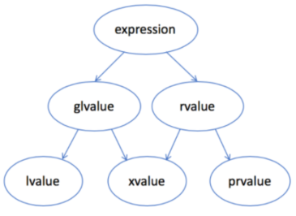

# 表达式的类型



- lvalue：左值，通常可以放在等号左边的表达式，有标识符，可以取地址
  - 变量，函数或数据成员的名字
  - 返回左值引用的表达式，如：++x，x = 1，cout <<'  '
  - 字符串字面量，如 "hello，world"
- rvalue：右值，通常只能放在等号右边的表达式
- gvalue：广义左值，generalized lvalue
- xvalue：将亡值，expiring lvalue
- prvalue：纯右值，pure rvalue，没有标识符，不可以取地址
  - 返回非引用类型的表达式，如：x++，x+1，make_shared<int>(42)
  - 除字符串字面量之外的字面量，如：42，true

右值引用的形式为：T&&。

```
template <typename U>
SharedPtr(SharedPtr<U>&& other) noexcept
{
    ptr_ = other.ptr_;
    if (ptr_)
    {
        shared_count_ = other.shared_count_;
        other.ptr_ = nullptr;
    }
}
```

other 本身是一个左值，但是它的类型是右值引用。

```
SharedPtr<Shape> ptr1{new Circle()};
SharedPtr<Shape> ptr2 = std::move(ptr1);
```

std::move 把一个左值引用强制转换成一个右值引用，并不改变其内容。可以将 std::move(ptr1)  看作是一个有名字的右值，为了跟无名的纯右值 prvalue 相区别，目前将这种表达式称为 xvalue，但是与 lvalue 不同，xvalue 仍然不能取地址。


# 生命周期和表达式类型

一个临时对象会在包含这个临时对象的完整表达式估值完成后，按生成顺序的逆序被销毁，除非有生命周期延长发生。

```
#include <stdio.h>

class Shape
{
public:
	virtual ~Shape() {}
};

class Circle : public Shape
{
public:
	Circle() { puts("Circle()"); }
	 ~Circle() { puts("~Circle()"); }
};

class Triangle : public Shape
{
public:
	Triangle() { puts("Triangle()"); }
	~Triangle() { puts("~Triangle()"); }
};

class Result
{
public:
	Result() { puts("Result()"); }
	~Result() { puts("~Result()"); }
};

Result process_shape(const Shape& shape1, const Shape& shape2)
{
	puts("process_shape()");
	return Result();
}

int main()
{
	puts("main()");
	process_shape(Circle(), Triangle());
	puts("something else");

	return 0;
}
```

结果：

```
main()
Triangle()
Circle()
process_shape()
Result()
~Result()
~Circle()
~Triangle()
something else
```

如果一个 prvalue 被绑定到一个引用上，它的生命周期则会延长到跟这个引用变量一样长。

```
Result&& r = process_shape(Circle(), Triangle());
```

结果：

```
main()
Triangle()
Circle()
process_shape()
Result()
~Circle()
~Triangle()
something else
~Result()
```

Result 的生成还是在原来的位置，但析构被延到了 main 的最后。

这条生命周期延长规则只对 prvalue 有效，而对 xvalue 无效，如果由于某种原因，prvalue 在绑定到引用以前已经变成了 xvalue，那生命周期就不会被延长。

```
Result&& r = std::move(process_shape(Circle(), Triangle()));
```

结果：

```
main()
Triangle()
Circle()
process_shape()
Result()
~Result()
~Circle()
~Triangle()
something else
```

这时的代码输出就回到了第一种情况。

执行到 "something else" 时候，仍然有一个有效的变量 r，但它指向的对象已经不存在了，对 r 的解引用是一个未定义行为，由于 r 指向的是栈空间，通常不会立即导致程序崩溃，而会在某些复杂的组合条件下才会引起问题。


