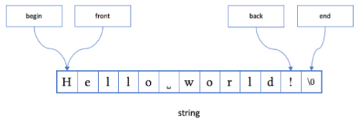
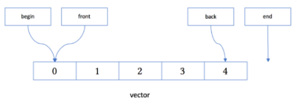
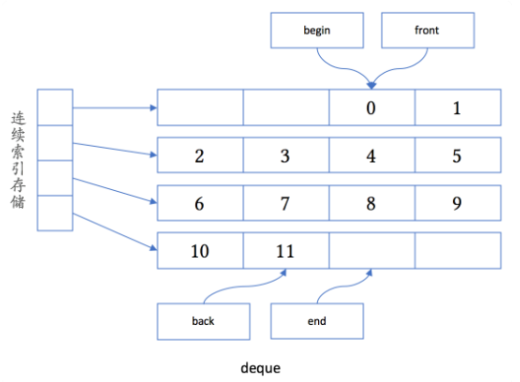
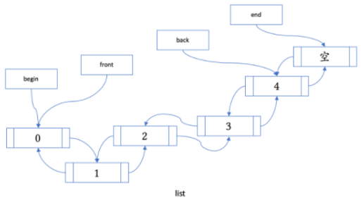
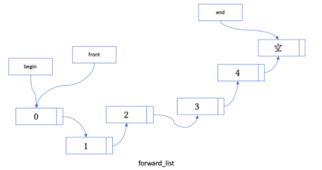
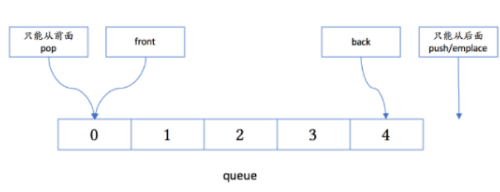
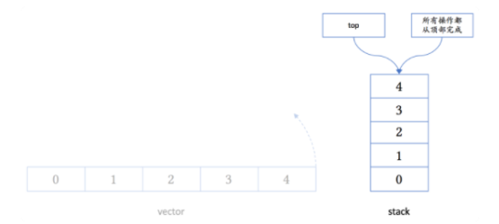

# string

string 是模板 basic_string 对于 char 类型的特化。

# vector

当需要内存重分配时，如果元素类型没有提供一个保证不抛出异常的移动构造函数，vector 通常将会使用拷贝构造函数，因此，对于拷贝代价比较高的自定义类型，应该定义移动构造函数，并将其标记为 noexcept，或者只在容器中放置对象的智能指针。

现代 CPU 架构对于连续内存的访问速度较快，vector 的内存连续是其一大优势。

vector 的缺陷是动态扩容，最好在使用之前使用 reserve 函数保留 vector 所需要的内存。

# deque

# list

成员函数：

- merge
- remove
- remove_if
- reverse
- sort
- unique

# forward_list

# queue

没有 begin 和 end 方法，无法遍历。

# stack

# priority_queue

priority_queue 默认使用 less 作为其 Compare 模板参数，顶部数据为最大值。

# 有序关联容器

- set 
- map
- multiset
- multimap

关联容器是有序的。

multi 开头的表示键可以重复，否则键不可以重复。

map 中查找一般使用：

- find
- lower_bound
- upper_bound

multimap 中查找：

- equal_range

如果声明关联容器没有提供比较类型参数，缺省使用 less 进行比较。对于自定义类型，尽量使用需要对键类型进行 less 特化，通过重载 < 对该类型对象进行排序。

关联容器中的键应该满足严格弱序关系。

# 无序关联容器

- unordered_set 
- unordered_map
- unordered_multiset
- unordered_multimap

这些容器不提供排序函数，但是要求有一个可以计算哈希值的函数对象。

# array

C 数组：

- 没有 begin 和 end 成员函数，但是可以使用全局的 begin 和 end 成员函数
- 没有 size 成员函数
- 退化成指针

array 则是 C 数组的替代品。

