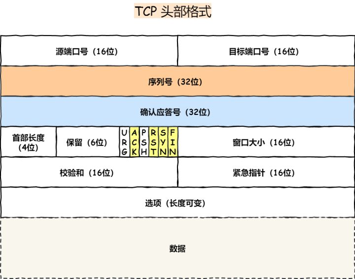
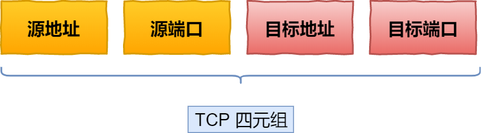

# TCP/UDP 基本认识

**序列号**：在建立连接时由计算机生成的随机数作为其初始值，通过 SYN 包传给接收端主机，每发送一次数据，就「累加」一次该「数据字节数」的大小。**用来解决网络包乱序问题。**

**确认应答号**：指下一次「期望」收到的数据的序列号，发送端收到这个确认应答以后可以认为在这个序号以前的数据都已经被正常接收。**用来解决不丢包的问题。**

**控制位：**

- ACK：该位为 1 时，确认应答的字段变为有效，TCP 规定除了最初建立连接时的 SYN 包之外该位必须设置为 1 。
- RST：该位为 1 时，表示 TCP 连接中出现异常必须强制断开连接。
- SYN：该位为 1 时，表示希望建立连接，并在其「序列号」的字段进行序列号初始值的设定。
- FIN：该位为 1 时，表示今后不会再有数据发送，希望断开连接。当通信结束希望断开连接时，通信双方的主机之间就可以相互交换 FIN 位为 1 的 TCP 段。

## 为什么需要 TCP 协议？ TCP 工作在哪一层？

IP 层是不可靠的，它不保证网络包的交付、不保证网络包的按序交付、也不保证网络包中的数据的完整性。

如果需要保障网络数据包的可靠性，那么就需要由上层（传输层）的 TCP 协议来负责。

因为 TCP 是一个工作在**传输层**的**可靠**数据传输的服务，它能确保接收端接收的网络包是**无损坏、无间隔、非冗余和按序的。**

##  什么是 TCP ？

TCP 是**面向连接的、可靠的、基于字节流**的传输层通信协议。

- **面向连接**：一定是一对一才能连接，不能像 UDP 协议可以一个主机同时向多个主机发送消息，也就是一对多是无法做到的
- **可靠的**：无论的网络链路中出现了怎样的链路变化，TCP 都可以保证一个报文一定能够到达接收端
- **字节流**：消息是没有边界的，所以无论我们消息有多大都可以进行传输。并且消息是有序的，当前一个消息没有收到的时候，即使它先收到了后面的字节，那么也不能扔给应用层去处理，同时对重复的报文会自动丢弃。

## 什么是 TCP 连接？

建立一个 TCP 连接是需要客户端与服务器端达成三个信息的共识：

- **Socket**：由 IP 地址和端口号组成
- **序列号**：用来解决乱序问题等
- **窗口大小**：用来做流量控制

## 如何唯一确定一个 TCP 连接呢？

TCP 四元组可以唯一的确定一个连接，四元组包括如下：

- 源地址
- 源端口
- 目的地址
- 目的端口

源地址和目的地址的字段（32位）是在 IP 头部中，作用是通过 IP 协议发送报文给对方主机。

源端口和目的端口的字段（16位）是在 TCP 头部中，作用是告诉 TCP 协议应该把报文发给哪个进程。

## 服务端TCP 的最大连接数是多少？

服务器通常固定在某个本地端口上监听，等待客户端的连接请求。因此，客户端 IP 和 端口是可变的，其理论值计算公式如下:

对 IPv4，客户端的 IP 数最多为 `2` 的 `32` 次方，客户端的端口数最多为 `2` 的 `16` 次方，也就是服务端单机最大 TCP 连接数，约为 `2` 的 `48` 次方。

当然，服务端最大并发 TCP 连接数远不能达到理论上限。

- 首先主要是**文件描述符限制**，Socket 都是文件，所以首先要通过 ulimit 配置文件描述符的数目；
- 另一个是**内存限制**，每个 TCP 连接都要占用一定内存，操作系统的内存是有限的。

## UDP 

UDP 不提供复杂的控制机制，利用 IP 提供面向无连接的通信服务。UDP 协议真的非常简，头部只有 8 个字节（ 64 位），UDP 的头部格式如下：

- **目标和源端口**：主要是告诉 UDP 协议应该把报文发给哪个进程。
- **包长度**：该字段保存了 UDP 首部的长度跟数据的长度之和。
- **校验和**：校验和是为了提供可靠的 UDP 首部和数据而设计。

## TCP 和 UDP 区别

### 连接

- TCP 是面向连接的传输层协议，传输数据前先要建立连接
- UDP 是不需要连接，即刻传输数据

### 服务对象

- TCP 是一对一的两点服务，即一条连接只有两个端点
- UDP 支持一对一、一对多、多对多的交互通信

### 可靠性

- TCP 是可靠交付数据的，数据可以无差错、不丢失、不重复、按需到达
- UDP 是尽最大努力交付，不保证可靠交付数据

###  拥塞控制、流量控制

- TCP 有拥塞控制和流量控制机制，保证数据传输的安全性
- UDP 则没有，即使网络非常拥堵了，也不会影响 UDP 的发送速率

### 首部开销

- TCP 首部长度较长，会有一定的开销，首部在没有使用选项字段时是 `20` 个字节，如果使用了选项字段则会变长的
- UDP 首部只有 8 个字节，并且是固定不变的，开销较小

### 传输方式

- TCP 是流式传输，没有边界，但保证顺序和可靠
- UDP 是一个包一个包的发送，是有边界的，但可能会丢包和乱序

### 分片不同

- TCP 的数据大小如果大于 MSS 大小，则会在传输层进行分片，目标主机收到后，也同样在传输层组装 TCP 数据包，如果中途丢失了一个分片，只需要传输丢失的这个分片
- UDP 的数据大小如果大于 MTU 大小，则会在 IP 层进行分片，目标主机收到后，在 IP 层组装完数据，接着再传给传输层，但是如果中途丢了一个分片，则就需要重传所有的数据包，这样传输效率非常差，所以通常 UDP 的报文应该小于 MTU

